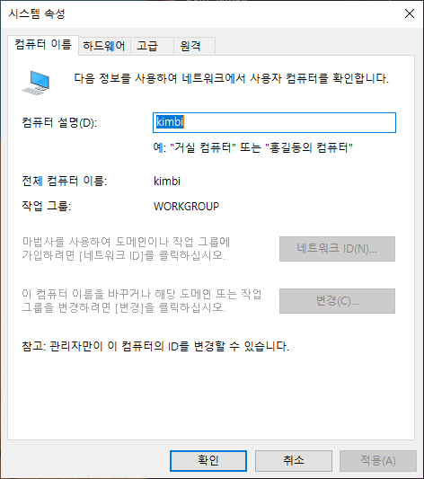
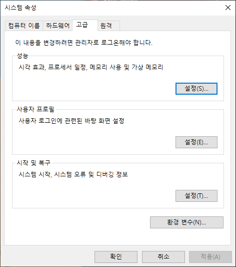
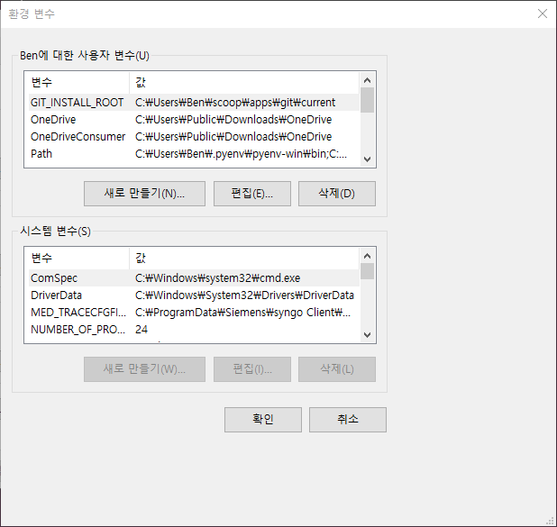
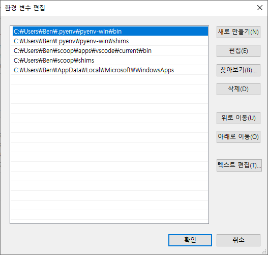

-   이 글에서는 사용자가 자신의 R과 Python이 어떤 폴더에 설치되어 있는지 알아내고자 할 때 우선 이해해야 할 경로 개념을 설명하고자 합니다.

-   그리고 각 운영체제별로 경로를 확인하는 방법을 안내하고자 합니다.

## 환경변수란?

-   컴퓨터에서 다양한 프로그램을 실행하다 보면, 여러 설정 값이나 경로를 시스템 전반에서 공통으로 사용할 필요가 있습니다.
-   예를 들어 실행 파일의 위치나 임시 폴더의 경로 등이 이에 해당합니다.
-   이러한 정보를 운영체제는 **환경 변수(Environment Variables)** 라고 부르며, 일반적으로 **시스템 환경 변수**와 **사용자 환경 변수**로 구분됩니다.
-   **시스템 환경 변수**는 모든 사용자에게 공통으로 적용되는 설정이며, **사용자 환경 변수**는 현재 로그인한 사용자에게만 적용됩니다.

## 경로란?

-   실행파일의 경로를 지정하는 환경변수를 PATH라고 부릅니다.
-   예를 들어 R이나 Python을 설치하면 해당 프로그램의 실행파일이 있는 폴더 경로가 PATH 환경변수에 추가됩니다.
-   이렇게 하면 터미널이나 명령 프롬프트에서 R이나 Python 명령어를 입력할 때 운영체제가 해당 실행파일을 쉽게 찾을 수 있습니다. (지정을 하지 않는다면 반드시 실행파일이 있는 폴더에서 실행해야 작동을 하는 제한이 있는데, 여러 실행파일들을 자동으로 실행할려면 이러한 제한이 문제가 되므로 PATH 지정은 자동화에서는 반드시 설정해야 하는 사항이라 이해하시면 됩니다.)

## 운영체제별 경로 확인 방법

### Windows

-   Windows에서는 `Windows키 + R` 핫키를 사용하여 실행창을 엽니다.
-   실행창에 아래와 같이 sysdm.cpl을 입력하고 확인을 클릭하여 시스템 속성 창을 엽니다.

``` command
sysdm.cpl
```



고급탭을 클릭하면 제일 아래에 환경 변수(N)... 버튼이 있고 클릭하시면



환경 변수 창이 열립니다.

 

위 부분은 Ben이라고 제가 현재 로그인한 사용자가 설정한 (혹은 Windows 또는 각종 프로그램이 사용자를 위해 설정해준) 환경변수 목록이 보입니다.

이 목록 안에 Path가 있습니다. 이를 선택하고 편집(E)...을 클릭해보면

\
\
몇 가지 실행파일의 경로가 보입니다.\
첫번째는 \`C:\Users\Ben.pyenv\pyenv-win\bin\`로써 Windows에서 Python의 버전을 관리해주는 tool의 실행경로(혹은 설치된 폴더로 이해하셔도 됩니다)가 보입니다.\
두번째로는 \`C:\Users\Ben.pyenv\pyenv-win\shims\`로써 pyenv-win이 우리가 원하는 파이썬 버전을 지정하도록 링크가 된 실행파일의 경로를 보여줍니다. 이하는 설명을 생략하겠습니다.

저는 pyenv를 통해서 python을 설치했기 때문에 python의 경로가 보이지 않습니다만, 만약에 저처럼 pyenv 를 사용하지 않고 직접 python을 설치했다면 python이 설치된 폴더 경로가 아래의 예시처럼 보였을 것입니다. C:\Users\Ben\AppData\Local\Programs\Python\Python-3.12.10\
그러나 설치폴더는 설치자가 지정하는대로 되기 때문에 실제 여러분이 설치한 폴더가 보여야 합니다.

그리고 설치시에 모든 사용자가 사용할 수 있도록 했다면 시스템 변수 영역에도 Path가 존재할 것입니다.

### macOS
-터미널에서 아래와 같이 입력하시면 경로목록이 출력된다고 합니다.
```bash
echo $PATH
```

- python의 경로를 직접 확인하는 방법은 아래와 같습니다.
```bash
which python
```
또는
```bash
which python3
```

