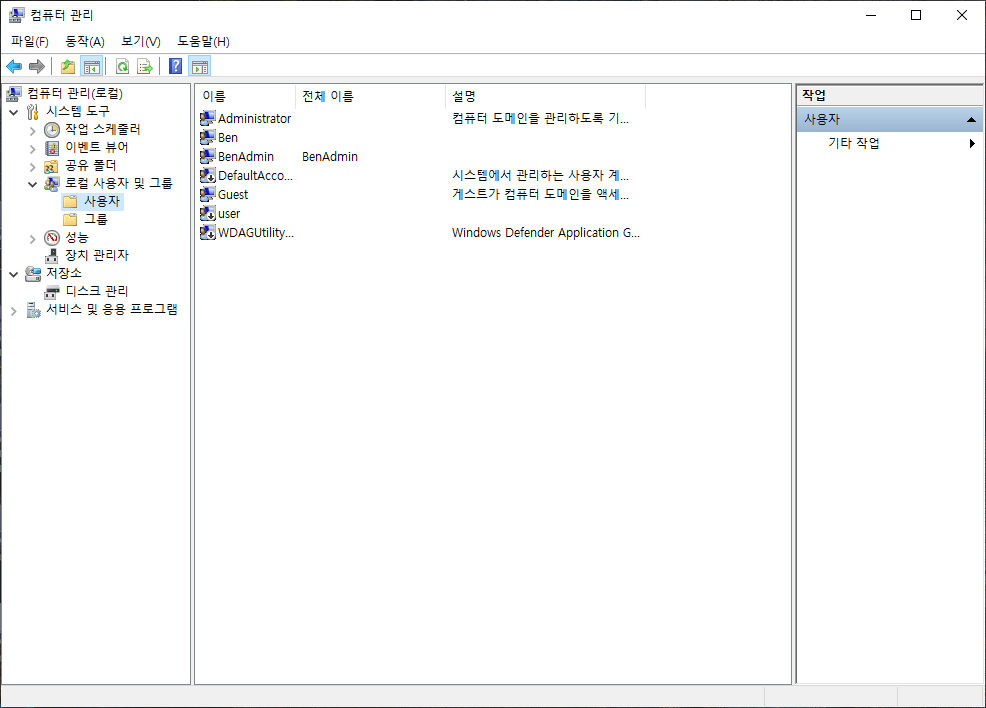
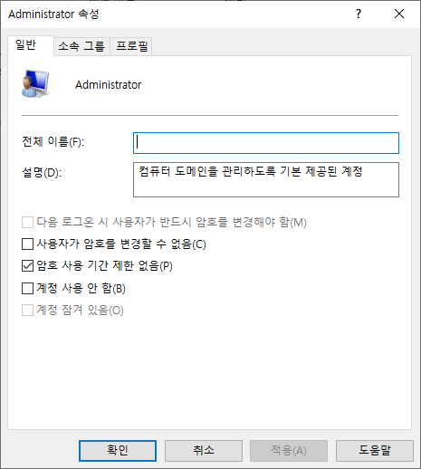
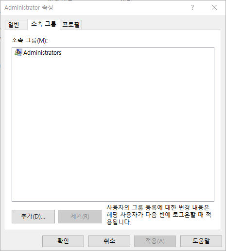
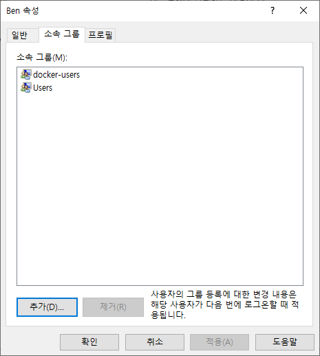
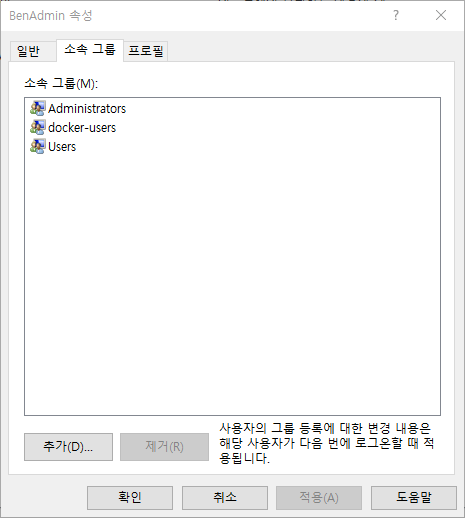

-   이 글에서는 사용자가 자신의 R과 Python이 어떤 폴더에 설치되어 있는지 알아내고자 할 때 우선 이해해야 할 사용자계정 개념을 설명하고자 합니다.

-   그리고 각 운영체제별로 사용자계정을 확인하는 방법을 안내하고자 합니다.

## 운영체제별 사용자계정에 대한 개념

-   '25.11.11 시점에서 저를 제외하면 우리 연구회는 대부분 Windows를 사용하시고 1명 macOS 사용하고 계시므로 이 글에서는 Windows 와 macOS에 대해서만 설명드립니다.

### Windows

#### Built-in Administrator 계정

-   Windows 시스템에서 최상위 권한을 가지며, 보안상 기본적으로 비활성화해 두는 것이 원칙입니다.
-   이 계정은 긴급 복구 상황에서만 사용하시는 것이 바람직하며, 일반적인 운영이나 개발환경 구축에서는 사용하지 않으시는 것이 원칙입니다.

#### 로컬 Administrators 그룹에 속한 사용자 계정(이하 관리자권한 계정)

-   소프트웨어 설치, 장치 드라이버 관리, 보안 정책 설정 등 시스템 관리 작업을 수행할 수 있도록 설계되어 있습니다.
-   개발환경 구축에서는 Built-in Administrator 계정보다는 안전하게 필요한 권한을 제공하므로, 관리 작업이나 초기 설정 계정으로 활용하는 것이 바람직합니다.

#### 관리자권한이 없는 표준사용자 계정(이하 표준사용자 계정)

-   시스템 설정 변경이나 시스템에 소프트웨어 설치는 할 수 없지만, 자신의 계정 하부의 폴더에 소프트웨어 설치는 가능하며, 또한 문서 작성, 코딩, 인터넷 사용 등 일상적인 작업에는 이 계정을 사용하는 것이 권장됩니다.

### macOS

#### root 계정

-   기본적으로 비활성화되어 있으며, 보안상 직접 사용하지 않습니다.

#### sudo 권한 계정

-   macOS 최초 설치 시 생성되는 계정입니다.
-   기본적으로 sudo를 통해 root 권한을 일시적으로 사용할 수 있으며, 개발환경 구축에는 이 계정을 사용합니다.

#### 일반 사용자 계정

-   sudo 권한이 없는 계정으로, 시스템 변경은 불가하지만 프로젝트 실행이나 코드 작성은 가능합니다.

## 운영체제별 사용자계정 확인 방법

### Windows

-   `Windows키 + X`를 눌러 목록을 띄우고 그 중에서 `컴퓨터관리`를 클릭하여 선택합니다.

-   왼쪽 메뉴에서 `로컬 사용자 및 그룹`을 확장하고 `사용자`를 클릭합니다.

 - 예시 그림에서는 Administrator/Ben/BenAdmin/Guest 계정이 보입니다. (화살표가 있는 DefaultAccount 계정은 시스템계정으로 지금 단계에서는 이해하지 않으셔도 됩니다 \^\^;)

1.  Administrator가 어떤 계정인지 확인하기

\- Administrator를 선택하여 더블클릭하면 아래와 같은 속성창이 열립니다.

-   소속 그룹 탭을 클릭하며 Administrators 그룹만 보입니다. 이는 Built-in Administrator 계정임을 의미합니다.

1.  Ben이 어떤 계정인지 확인하기

    1.  앞서와 같이 Ben을 선택하여 더블클릭하면 속성창이 열립니다.

    2.  소속 그룹 탭을 선택하면 이번에는 Administrators가 없고 Users만 보입니다. (저자의 경우 docker-users라고 특이사항이 보이는데 지금 단계에서는 이것은 무시하셔도 됩니다. \^\^;). 이는 표준사용자계정임을 의미합니다.

1.  BenAdmin이 어떤 계정인지 확인하기

    1.  앞서와 같이 BenAdmin을 선택하여 더블클릭하면 속성창이 열립니다.

    2.  소속 그룹 탭을 선택하면 이번에는 Administrators도 있고 Users도 있습니다. (저자의 경우 docker-users라고 특이사항이 보이는데 지금 단계에서는 이것은 무시하셔도 됩니다. \^\^;). 이는 관리자계정임을 의미합니다.

위의 방법은 시스템에 등록된 모든 사용자의 유형을 파악하기에 도움이 됩니다. 그런데 현재 로그인된 사용자의 권한을 확인하려면 **Windows 설정 → 계정 → 사용자 정보**로 이동하십시오.
계정 이름 아래에 **“관리자”** 라고 표시되어 있으면 관리자 권한이 있는 계정을 사용 중인 것입니다.

### macOS
제가 macOS가 없어서 직접 테스트 할 수 없지만, 일반적으로 다음과 같은 방법으로 확인할 수 있다 합니다.
터미널에서 `groups`명령을 입력하여 결과에 `adm` 또는 `admin`이 있으면 sudo 명령이 가능한 사용자라 합니다.
