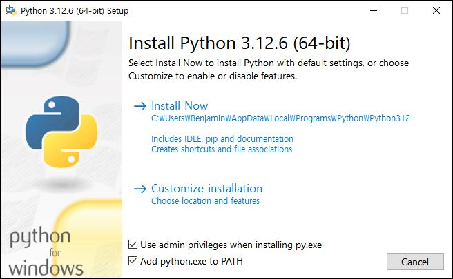
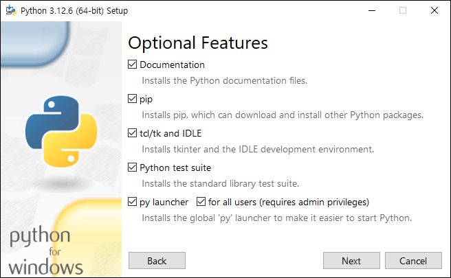

## 설치안내문서

Python 공식사이트에서 제공하는 공식문서(<https://docs.python.org/3/using/index.html>)를 참고하는 것이 이상적이겠지만, 아래의 요약을 참고하여 설치 하셔도 됩니다.

## Window 운영체제에서의 설치

### 설치 파일

공식 Python 웹사이트(<https://www.python.org/>)에서 운영체제에 적합한 최신 Python 인터프리터를 다운로드하고 설치합니다. 2024년 9월 6일 기준으로 Windows 운영 체제의 경우 `python-3.12.6-amd64.exe` 설치파일(2024년 9월 6일 release)이 최신입니다.

### 설치옵션

#### Install Now와 Customize installation 중의 선택

윈도우에 처음 설치하는 경우에는 연구회에서는 Install Now 대신 Customize installation 선택을 추천합니다 (@fig-CustomizeInstallation). 이는 설치경로를 우리가 원하는데로 `C:\Python\Python-x.y.z`로 설정할 수 있는 장점이 있습니다. (개인의 취향에 따라 `Python`을 `P`로 `x.y.z`를 `xyz`로 줄이셔도 됩니다.) (Command line interface 에서 경로를 입력할 때를 가정하면 짧고 직관적인게 좋습니다.).

#### Add python.exe to PATH

Python 설치 시 실행 파일의 경로를 시스템의 환경 변수(PATH)에 등록하는 것은 유용합니다 (@fig-CustomizeInstallation). 이 설정을 통해 Visual Studio Code와 같은 통합 개발 환경(IDE)에서 Python 인터프리터를 자동으로 인식할 수 있게 됩니다.

또한, 이 설정은 명령 프롬프트나 터미널에서 Python 실행 파일이 위치한 폴더가 아닌 다른 위치에서도 'python' 명령어를 직접 입력하여 Python을 실행할 수 있게 해줍니다. 이는 개발자가 어느 위치에서나 Python 코드를 실행하고 테스트할 수 있는 유연성을 제공합니다.

{#fig-CustomizeInstallation}

#### Optional Features

Optional Feature 선택 단계에서는 전 항목 선택하시는 것을 추천드립니다 (@fig-OptionalFeature).

{#fig-OptionalFeature}

### 설치 확인

::: {.callout-note title="Python이 올바르게 설치되었는지 확인하려면," collapse="true" appearance="minimal"}
Win + R을 눌러 실행 대화창을 열고 `cmd`를 입력하여 명령 프롬프트를 실행합니다.

```{r cmd_kr, eval=FALSE, filename="Command Prompt"}
cmd
```

명령 프롬프트에서 다음 명령을 입력하여 설치된 Python 버전이 예상 버전과 일치하는지 확인합니다.

```{r Python_version_kr, eval=FALSE, filename="Command Prompt"}
python --version
```

또는

```{r Python_version2_kr, eval=FALSE, filename="Command Prompt"}
python --V
```
:::

### 폴더 구조

일반적인 구조는 @fig-PythonDirectory 와 같으며 설치옵션에 따라 달라질 수 있습니다.

::: {#fig-PythonDirectory}
```         
C:\Python\Python-x.y.z\                # Top-level Python installation directory
           ├─ DLLs\                   # Dynamic Link Libraries folder
           ├─ Doc\                    # Documentation folder (optional installation)
           ├─ include\                # C/C++ header files folder
           ├─ Lib\                    # Standard library and third-party packages folder
           │   └─ site-packages\      # Folder for packages installed via pip
           ├─ libs\                   # Additional libraries folder
           ├─ Scripts\                # Scripts folder, contains executable files like pip
           ├─ tcl\                    # Tcl/Tk libraries folder
           ├─ python.exe              # Python executable file
           └─ pythonw.exe             # Python executable for GUI applications without a console window
```

Python Installation Directory Structure with Full Option
:::

### 새로운 버전의 Python 실행파일 설치하기

새로운 버전의 실행파일의 설치 시 `Upgrade Now`가 아닌 `Customize installation`을 추천합니다 @fig-UpgradePython.

{#fig-UpgradePython}

이 때 아래와 같은 명명방식으로 새로운 경로에 설치하는 것을 추천합니다. (개인의 취향에 따라 `Python`을 `P`로 `x.y.z`를 `xyz`로 줄이셔도 됩니다.)

```{r Python_uprade, eval=FALSE, filename="Install Window"}
C:\Python\Python-x'.y'.z'\  
```

::: {.callout-note title="새로운 경로에 설치하는 이유는 ......," collapse="true" appearance="minimal"}
기존의 실행파일로 된 프로젝트를 그대로 유지하기 위해서입니다. 이는 드물겠지만 새로운 실행파일이 기존의 프로젝트에서 오류가 발생하거나 혹은 기존의 패키지와 새로운 실행파일의 호환이 제한되거나 오류가 발생할 수도 있기 때문입니다. 새로운 경로에 설치하면 폴더 구조는 @fig-PythonNewDirectory 와 같이 될 것입니다.
:::

::: {#fig-PythonNewDirectory}
```         
C:\Python\Python-x.y.z\     # existing Python installation directory
       └─ Python-x'.y'.z'\  # New Python installation directory
```

Python customize Installation with new release and Directory Structure
:::

## WSL2 Ubuntu 운영체제에서의 설치

### 필수 패키지 설치

```{r Ubuntu_Install, eval=FALSE, filename="bash"}
sudo apt update
sudo apt install -y build-essential libssl-dev zlib1g-dev \
    libbz2-dev libreadline-dev libsqlite3-dev wget curl llvm \
    libncursesw5-dev xz-utils tk-dev libxml2-dev libxmlsec1-dev libffi-dev liblzma-dev
```

### 기존 pyenv 삭제

```{r Ubuntu_pyenv_delete, eval=FALSE, filename="bash"}
rm -rf ~/.pyenv
```

-   만약에 기존에 설치된 것이 있다면 제거합니다.

### pyenv 설치

```{r Ubuntu_pyenv, eval=FALSE, filename="bash"}
curl https://pyenv.run | bash
```

-   `| bash`의 의미는, curl이 지정한 URL에서 스크립트를 다운로드한 후 그 결과를 bash 쉘에 전달하여 바로 실행하라는 뜻입니다.

### pyenv 환경변수 설정

```{r Ubuntu_pyenv_env, eval=FALSE, filename="bash"}
export PATH="$HOME/.pyenv/bin:$PATH"
eval "$(pyenv init --path)"
eval "$(pyenv init -)"
eval "$(pyenv virtualenv-init -)"
```

### 원하는 버전 설치

```{r Ubuntu_pyenv_install, eval=FALSE, filename="bash"}
pyenv install 3.12.6
pyenv global 3.12.6
```

### 설치 확인

```{r Ubuntu_pyenv_check, eval=FALSE, filename="bash"}
python --version
```
