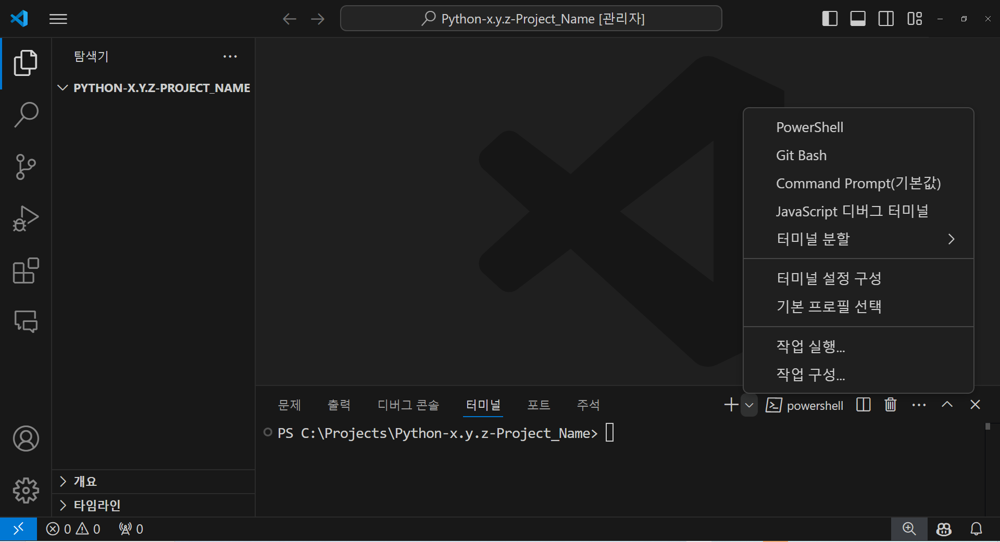
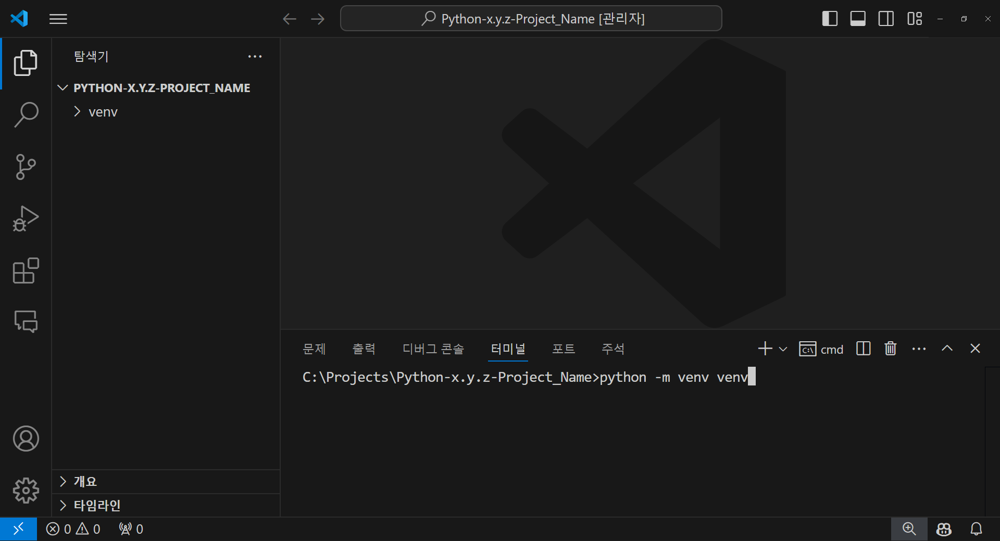
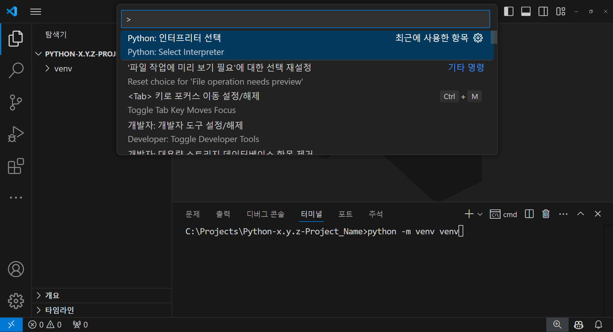
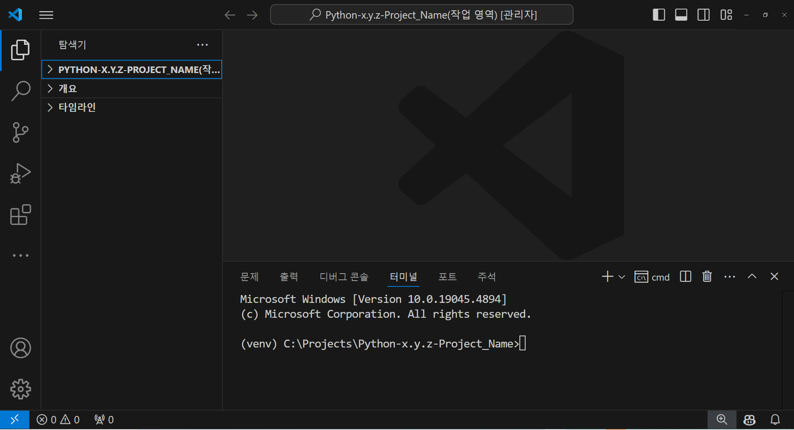
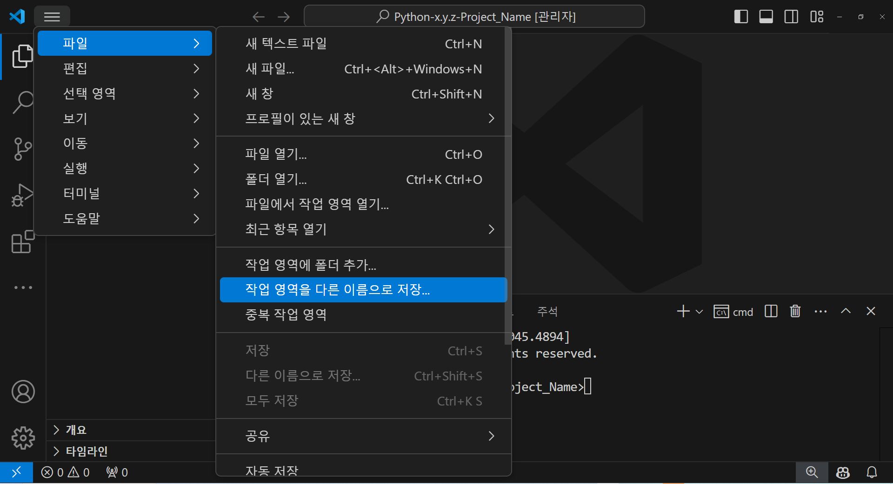
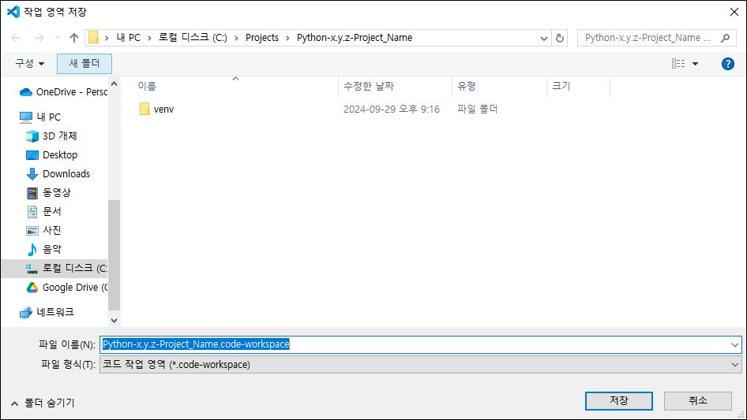

## Python IDE 추천

Python 개발에 적합한 다양한 통합개발환경(Intergrated Developement Enviroment, IDE) 중에서 PyCharm은 강력한 기능과 Django 통합을 제공하지만 시스템 자원을 많이 소모하며 유료입니다.

Jupyter Notebook은 데이터 과학에 최적화되어 있지만, 대규모 코드베이스 관리나 전통적인 IDE 기능에는 제한이 있습니다.

Spyder는 과학 계산에 특화되어 있으나, 범용 개발에는 한계가 있습니다.

반면, Visual Studio Code (VS Code)는 확장성이 뛰어나며 다양한 프로그래밍 언어 지원과 시스템 자원 소모가 적은 경량의 IDE로, 필요에 따라 확장 기능을 추가할 수 있어 Python 개발을 포함한 여러 프로젝트를 효과적으로 관리할 수 있습니다.

연구회에서는 Python 개발에 VS Code를 우선 추천합니다.

## 설치 안내

공식문서(<https://code.visualstudio.com/docs/setup/setup-overview>)에서 자신의 운영체제에 맞는 안내를 참고하는 것이 이상적이며, 아래의 요약을 참고하여 설치 하셔도 됩니다.

## Window 운영체제에서의 설치

### 설치 파일

공식 웹사이트(<https://code.visualstudio.com/Download>)에서 운영 체제에 맞는 최신 설치 파일을 다운로드하고 설치합니다. Window 운영체제에서 몇가지 선택이 가능한데 System installer (모든 사용자들이 VS Code가 사용가능한 설치파일)를 추천하며, 2024년 9월 29일 기준으로 Windows 운영 체제에는 VSCodeSetup-1.93.1.exe 파일이 최신입니다.

### 설치 경로

Window 운영체제의 경우 기본 설치경로는 `C:\Users\{Username}\AppData\Local\Programs\Microsoft VS Code`이며 이를 추천합니다.

### VS Code 레이아웃

설정을 설명함에 있어 VS Code 공식문서(<https://code.visualstudio.com/docs>)에서 사용된 용어를 사용하고자 합니다. 레이아웃 구성요소에 대한 용어는 @fig-BasicLayout 을 참고하시길 바랍니다. 그러나 "타이틀 및 메뉴 바"와 같은 용어는 공식 문서에 명시적으로 정의되지 않았지만 명확한 설명을 위해 필요하다고 생각되어 여기에서는 임의적으로 정의하여 사용하겠습니다.

{#fig-BasicLayout}

### Python 확장(기능) 설치

VS Code에서 Python을 실행코드를 작성 및 실행할려면 Python이라는 확장(기능)을 설치해야 합니다. VS Code를 처음 실행하면 환영 페이지가 표시됩니다. 이 페이지에서 Python 확장을 설치하거나 대신 Ⓐ Activity bar의 확장 메뉴를 사용하여 설치할 수 있습니다. 설치된 확장 프로그램은 확장 프로그램 메뉴의 INSTALLED 섹션에서 확인할 수 있습니다 (@fig-PythonExtension). 이로써 VS code에서 Python을 사용할 수 있는 기본적인 설정을 되었습니다.

{#fig-PythonExtension}

### 프로젝트 폴더명 추천

R 처럼 Python에서도 프로젝트별 독립관리는 프로젝트 폴더 단위로 구현됩니다. 우리 연구회에서는 R과 Python을 사용하므로 C: 루트 디렉토리 아래에 Projects란 폴더를 만들고 각 실행파일의 버전이 폴더명에 먼저 포함되고 이어서 프로젝트를 상징하는 간결한 이름를 부여할 것을 추천합니다 (@fig-ProjectFolderExample).

::: {#fig-ProjectFolderExample}
```         
C:\Projects\R-x'.y'.z'-Project_Name'\            # R project directory and project name example
         └─ Python-x.y.z-Project_Name\  # Python project directory and project name example
```

Project folder location and name example
:::

### 프로젝트별 가상환경 만들기

파이썬 가상 환경은 개발자가 각기 다른 프로젝트에서 필요로 하는 다양한 라이브러리와 파이썬 버전을 독립적으로 관리할 수 있게 해줍니다. 이는 서로 다른 의존성 요구 사항을 가진 여러 프로젝트를 동일한 시스템에서 충돌 없이 운영할 수 있도록 하며, 개발 환경을 격리시켜 한 프로젝트에서 발생하는 문제가 다른 프로젝트에 영향을 미치지 않도록 합니다. 또한, 가상 환경은 프로젝트의 특정 설정을 쉽게 다른 환경으로 복제하거나 배포할 수 있도록 지원함으로써, 개발과 테스트, 프로덕션 환경 간의 일관성을 유지할 수 있게 해주고, 팀 작업에서도 각 개발자가 동일한 설정에서 작업할 수 있도록 도와줍니다. 이러한 이유로, 가상 환경은 프로젝트의 안정성과 개발 효율성을 크게 향상시키는 중요한 도구입니다. 다음은 VS Code에서 Python 가상 환경을 구현하는 방법을 설명합니다.

#### 프로젝트 폴더 생성

앞서의 설명처럼 프로젝트 폴더를 만듭니다. 그러나 VS Code에서는 폴더를 직접 생성할 수 있는 옵션이 없습니다. 따라서 프로젝트 폴더를 만들기 위해 Windows 탐색기를 사용하는 것이 좋습니다. (대신 VS Code의 타이틀 및 메뉴 바에 있는 터미널 탭을 사용하여 프로젝트 폴더를 만들 수 있지만, 이 방법은 Windows 탐색기를 사용하는 것보다 더 번거로울 수 있습니다.) 예를 들어 프로젝트 폴더를 다음과 같이 이름을 지어 만듭니다(예: C:\Projects\Python-x.y.z-Project_Name).

#### 프로젝트 폴더 열기

탐색기 메뉴(Ⓐ Activity bar)나 타이틀 및 메뉴 바의 파일 메뉴를 사용하여 프로젝트 폴더를 엽니다. (이는 이후에 터미널을 열 때, 프로젝트 폴더에서 열리게 하기 위함입니다.)

#### 새터미널 생성

타이틀 및 메뉴 바에서 터미널(T) 메뉴 하부의 새터미널 메뉴를 선택하여 새로운 터미널을 Ⓓ 패널에 열리게 합니다. 이 때 열린 터미널이 만약 powershell이라면 패널 타이틀 바 우측에 있는 `+(새 터미널)` 기호 옆의 `v(시작 프로필)`메뉴를 선택하고 (@fig-CommandPrompt), 터미널의 종류를 `Command Prompt`를 선택하여 새로운 Command Prompt 터미널을 생성해 줍니다.

{#fig-CommandPrompt}

#### Python 가상 환경 생성

새롭게 만들어진 터미널 내에서 다음 명령을 입력 및 실행합니다.

```{r Python_virtual_ko, eval=FALSE, filename="Command Prompt Terminal"}
python -m venv venv
```

::: {.callout-note title="python -m venv venv 의미는 ......" collapse="true" appearance="minimal"}
Python의 내장 모듈 venv를 사용하여 새로운 가상 환경을 생성하는 명령입니다.

1\. python 이 부분은 시스템에 설치된 Python 인터프리터를 호출합니다. 명령을 실행하는 시스템에서 기본적으로 설정된 Python 버전을 사용하여 다음에 지정된 모듈을 실행합니다.

2\. -m 플래그는 Python에게 명령 라인에서 직접 모듈을 실행하도록 지시합니다. 이 플래그 다음에 오는 모듈 이름(venv 등)에 해당하는 파이썬 모듈을 찾아 그 모듈을 스크립트처럼 실행하게 합니다.

3\. 첫번째 venv는 Python에 내장된 가상 환경 생성 모듈의 이름입니다. 이 모듈은 가상 환경을 생성, 관리, 유지하는 데 사용되며, 이 가상 환경은 독립된 Python 실행 환경을 제공합니다. 이 환경 내에서는 독립된 파이썬 인터프리터, 라이브러리, 스크립트가 포함되어 있습니다.

4\. 두번째 venv는 생성될 가상 환경의 디렉토리 이름입니다. 이 예에서는 현재 디렉토리 내에 'venv'라는 이름의 폴더를 생성하고, 그 안에 가상 환경을 구축합니다. 디렉토리 이름은 사용자가 원하는 어떤 이름으로도 지정할 수 있으며, 이 이름으로 생성된 폴더 안에 가상 환경이 설정됩니다.

따라서 `python -m venv venv` 명령은 현재 작업 중인 디렉토리에 'venv'라는 이름의 폴더를 생성하고, 그 안에 새로운 독립적인 Python 가상 환경을 설정합니다. 이 가상 환경은 다른 프로젝트와 독립적으로 Python 패키지를 설치하고 관리할 수 있는 개별적인 환경을 제공합니다. 이는 의존성 충돌을 방지하고 프로젝트 별로 다른 요구사항을 갖는 라이브러리들을 효과적으로 관리할 수 있게 해 줍니다.
:::

위 명령의 실행결과로써 프로젝트 폴더아래에 venv 가상화폴더가 생성되었습니다. 이는 탐색기 의 프로젝트폴더 아래에 venv라는 폴더가 보이면 성공한 것입니다 (@fig-VenvValidation).

{#fig-VenvValidation}

가상화로 만들어진 venv 폴더하부에는 다음과 같은 폴더와 파일이 생성됩니다 (@fig-VenvDirectory).

::: {#fig-VenvDirectory}
```         
(venv)/
   ├── Include/                  # Folder for C/C++ header files
   ├── Lib/                      # Folder for standard libraries and third-party packages
   │      └── site-packages/     # Folder where packages installed via pip are located
   ├── Scripts/                  # Folder containing executable scripts, such as pip
   │      ├── activate           # Script to activate the virtual environment
   │      ├── deactivate         # Script to deactivate the virtual environment
   │      ├── python.exe         # Python executable for the virtual environment
   │      └── pip.exe            # pip executable for managing packages in the virtual environment
   └── pyvenv.cfg                # Configuration file for the virtual environment
```

(venv) Directory Structure
:::

가상화환경 내에서는 pip로 패키지를 설치하면 글로벌에 설치되는 것이 아니라 venv 가상폴더 내의 site-packages 폴더에 설치됩니다. 이로써 프로젝트별로 필요한 패키지를 독립적으로 관리할 수 있게 되며, 이를 통해 프로젝트 간의 의존성 충돌을 방지할 수 있습니다.

#### 프로젝트와 가상환경 연결

`타이틀과 메뉴 바`의 `보기(V)` 메뉴에서 `명령 팔레트` 메뉴를 선택하면, 선택가능한 명령들이 리스트로 조회되며 이 중에서 `Python: 인터프리터 선택` 메뉴를 선택합니다 (@fig-SelectInterpreter).

{#fig-SelectInterpreter}

위의 선택에 따라 현재 상황에서 선택 가능한 모든 Python 인터프리터가 조회되며, 이중에서 직전에 만든 프로젝트 폴더 아래의 venv 가상화폴더 아래의 Scripts 폴더 내의 python.exe를 선택합니다 (@fig-InterpreterSelection).

{#fig-InterpreterSelection}

가상환경의 python 인터프리터를 선택하여 특정 프로젝트와 특정 가상환경의 인터프리터를 연결하더라도 화면에서는 아무런 변화가 없습니다. 오류없이 연결이 잘 되었는지 확인은 새 터널을 생성하면 @fig-ValidationVertualization 에서의 같이 터미널의 프롬프트에 `(venv)`의 가상화폴더를 괄호로 둘러싼 것이 보이게 되며, 이를 통해 성공적인 연결을 확인할 수 있으며 현재 가상화가 활성화되어 있음을 알 수 있습니다.

{#fig-ValidationVertualization}

### 프로젝트별 설정저장

프로젝트폴더에 가상환경설정까지 마친 후 이 상태를 저장해 둘 수 있습니다. 이를 위해 `타이틀 및 메뉴 바`의 `파일(F)` 메뉴에서 `작업영역을 다름이름으로 저장` 메뉴를 선택하면 됩니다 (@fig-WorskspaceSaveas).

{#fig-WorskspaceSaveas}

이 때 프로젝트 폴더에 프로젝트폴더이름.code-workspace 파일이 만들어지면 프로젝트폴더의 설정이 저장됩니다 (@fig-CodeWorkspace). 그리고 프로젝트를 다시 열 때 이 파일을 선택하면 프로젝트폴더의 설정이 자동으로 불러와집니다.

{#fig-CodeWorkspace}

## WSL2/Ubuntu 운영체제에서 Window 설치된 VS Code로 사용하기

-   WSL2/Ubuntu 운영체제에서 Window 설치된 VS Code로 사용하기 위해서는 WSL2에 Ubuntu를 설치하고, Window에 VS Code를 설치한 후, WSL2에 VS Code를 설치하여야 합니다.
-   이는 아래의 WSL2/Ubuntu에 VS Code Server를 설치하는 방법보다 불필요한 커널을 사용하지 않아서 성능이 더 좋다고 생각됩니다.

### WSL 확장의 설치

-   Window에 설치된 VS Code에서 WSL 확장을 설치합니다. 이는 Window에 설치된 VS Code에서 WSL2의 Ubuntu를 사용할 수 있도록 해주는 확장입니다.
-   VS Code를 실행한 후, Ⓐ Activity bar의 확장 메뉴를 선택하고, 검색창에 `WSL`을 입력하여 WSL 확장을 설치합니다. 설치된 확장 프로그램은 확장 프로그램 메뉴의 INSTALLED 섹션에서 확인할 수 있습니다.

## \## WSL2/Ubuntu 운영체제에서의 설치

-   WSL2/Ubuntu는 Ubuntu proper와는 달리 GUI 지원이 원할치 않습니다. 따라서 여기에서는 VS Code 대신 code server를 진행합니다.
-   code server는 VS Code의 웹 버전으로, 원격 서버에서 실행되며 웹 브라우저를 통해 접근할 수 있습니다. 이를 통해 GUI 환경이 없는 서버에서도 VS Code의 기능을 사용할 수 있습니다.

### 시스템 업데이트

```{r Ubuntu_update, eval=FALSE, filename="bash"}
sudo apt update && sudo apt upgrade -y
```

### 필수 패키지 설치

```{r packages_install, eval=FALSE, filename="bash"}
sudo apt install curl wget gnupg -y
```

### code-server 설치

```{r code-server_install, eval=FALSE, filename="bash"}
curl -fsSL https://code-server.dev/install.sh | sh
```

### code-server 첫실행

```{r code-server-excution, eval=FALSE, filename="bash"}
code-server
```

-   화면에 Password가 나옵니다.

### code-server 설정

```{r code-server-excution2, eval=FALSE, filename="bash"}
~/.config/code-server/config.yaml
```

```{r code-server-configuration, eval=FALSE, filename="config.yaml"}
bind-addr: 127.0.0.1:8080
auth: password
password: mysecurepassword
cert: false
```

-   이후 비밀번호 없이 바로 접속 가능하며, 포트도 변경 가능 (8080 → 8888 등)합니다.

### 백그라운드 실행

```{r code-server-excution_background, eval=FALSE, filename="bash"}
code-server
```
