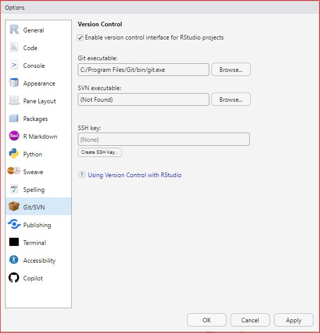
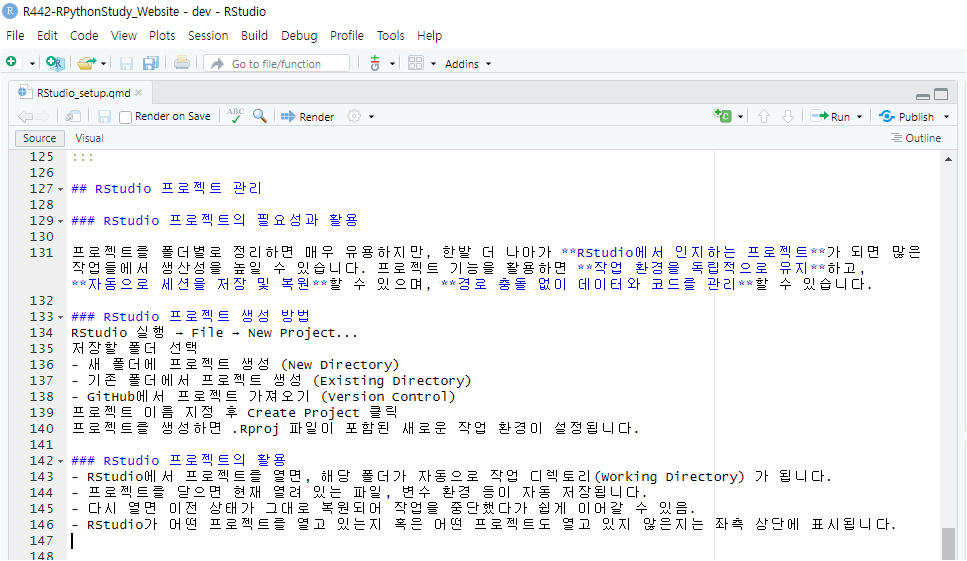

## R 통합개발환경 선택

RStudio와 VS Code는 모두 각자의 특징을 가진 R 프로그래밍을 위한(할수 있는) 통합 개발 환경(IDE)입니다.

RStudio는 R 코딩에 전용화된 통합개발환경으로 R 언어와 관련된 다양한 기능을 직관적으로 제공하며, R 코드 작성, 데이터 시각화, 리포팅 등에 최적화되어 있습니다.

반면에 VS Code는 다양한 프로그래밍 언어를 지원하며, Marketplace에서 제공하는 확장 기능을 통해 개발자가 필요한 기능을 추가할 수 있는 유연성을 가지고 있습니다. VS Code는 경량화된 성능과 통합 터미널 기능을 제공하여 다양한 개발 환경에서 활용될 수 있지만, R에 특화된 기능은 상대적으로 부족할 수 있습니다.

연구회에서는 RStudio를 우선 추천합니다.

## Window 환경에서의 설치

### 실행파일 다운로드

최신버전의 RStudio 실행파일을 \[공식 다운로드 사이트\](<https://posit.co/downloads/>){target="\_blank"}에서 다운로드 후 설치합니다.

### 설치경로

1.  프로그램 설치 폴더 `C:\Program Files\RStudio` RStudio의 실행 파일 및 주요 프로그램 파일이 저장되는 위치입니다. 프로그램 업데이트 시 이 폴더 내의 파일이 변경됩니다.
2.  사용자별 설정 폴더 `C:\Users\사용자명\AppData\Local\RStudio` 개별 사용자의 RStudio 설정을 저장합니다. UI 레이아웃, 최근 사용한 프로젝트, 마지막으로 연 코드 파일 등의 정보를 포함합니다.
3.  로그 파일 `C:\Users\사용자명\AppData\Local\RStudio\log` RStudio의 로그 파일이 저장되는 위치입니다. 이 폴더에는 RStudio의 실행 로그가 저장됩니다.
4.  전역 설정 폴더 (모든 사용자 적용) `C:\ProgramData\RStudio`

## Window환경에서의 고유설정

### R 경로설정

설치 이후 RStudio을 실행한 후 상단의 탭매뉴 중 Tools 메뉴 \> Global Options... \> R General \> Basic 탭에서 아래의 예시와 같이 설치하신 최신버전의 R 실행경로를 선택해 주시면 됩니다.

```{r RStudio_R_version, eval=FALSE, filename="R version: example"}
[64-bit] C:\R\R-4.4.3}
```

### R 버전변경

지난 버전의 R의 만든 프로젝트를 해당 버전으로 실행하고 싶다면 위의 R 경로설정 메뉴에서 해당 버전의 R 실행파일의 경로를 지정해주시면 됩니다.)

### RStudio 작업폴더

Default working directory (when not in a project)지정은 아래의 예시와 같이 프로젝트를 관리하는 상위 폴더를 추천 드립니다.

```{r RStudio_R_wd_window, eval=FALSE, filename="Default working directory: example"}
C:\Projects}
```

## Ubuntu/WSL2 환경에서 RStudio Server 설치

### 주의사항

-   Ubuntu와는 다르게 WSL2에 설치된 우분투는 원칙적으로 GUI를 지원하지 않습니다. 따라서 RStudio Desktop을 설치하여도 정상작동이 되지 않으며, WSL2에서 GUI가 가능하도록 설정하기가 어려워 보이고 사양에 따라서는 사실상 불가능해 보이기도 합니다.
-   따라서 연구회에서는 RStudio server를 설치하여 웹 브라우저를 통해 접속하는 것을 추천합니다. (단 한번에 하나의 server만 구동되는 제한이 있으며 유료버전에서는 가능하다 하지만 이것 때문에 구매할 필요는 없어 보입니다.)

### 설치안내

[공식사이트](https://posit.co/download/rstudio-server/){target="_blank"}를 참고하였습니다.

#### deb 형태의 설치파일을 위한 gdebi 설치

```{r gdebi, eval=FALSE, filename="Ubuntu Bash"}
sudo apt-get install gdebi-core
```

#### RStudio server 설치파일 다운로드

```{r wget_RStudio_server, eval=FALSE, filename="Ubuntu Bash"}
wget https://download2.rstudio.org/server/jammy/amd64/rstudio-server-2024.12.1-563-amd64.deb
```

#### RStudio server 설치

```{r gdebi_RStudio_server, eval=FALSE, filename="Ubuntu Bash"}
sudo gdebi rstudio-server-2024.12.1-563-amd64.deb
```

#### RStudio server 실행

-   GUI를 사용하지 않고 웹브라우저로 실행하게 됩니다.

```{r log_in, eval=FALSE, filename="인터넷창"}
http://localhost:8787
```

#### 로그인 정보

-   WSL2 Ubuntu의 사용자명과 비밀번호로 로그인하도록 미리 설정되어 있습니다.
    -   사용자명: 현재 Ubuntu 사용자명 (예: ben)
    -   비밀번호: WSL2 Ubuntu 로그인 비밀번호

### RStudio server 고유설정

#### 작업폴더 설정

설치 이후 RStudio server를 실행한 후 상단의 탭매뉴 중 Tools 메뉴 \> Global Options... \> R General \> Basic 탭에서 default working directory (when not in a project)지정은 아래의 예시와 같이 프로젝트를 관리하는 상위 폴더를 추천 드립니다.

```{r RStudio_sersver_R_wd_window, eval=FALSE, filename="Default working directory: example"}
~/projects
```

-   \~의 의미는 사용자 홈 디렉토리를 의미합니다.

#### Github Copilot 활성화 방법

-   rstudio server 환경에서 github copilot 을 사용하려고 보니 아래처럼 Github Copilot integration has been disabled by the administrator 라는 문구가 떴있습니다.
-   만약 Copilot 유로구독을 하시고 있다면, Rstudio Server나 Posit Workbench에서는 관리자 설정 이후 사용이 가능하다고 합니다.

##### **설정파일이 있는 폴더로 이동**

```{r cd_rstudio, eval=FALSE, filename="bash"}
cd /etc/rstudio/
```

##### 설정파일을 nano 편집기로 열기

```{r sudo_vim, eval=FALSE, filename="bash"}
sudo nano rsession.conf
```

##### 설정파일에 아래의 내용 추가

```{r copilot, eval=FALSE, filename="rsession.conf"}
copilot-enabled=1
```

## macOS환경에서의 설치

### MacOS 폴더구조

-   저자는 MacOS를 사용하지 않아서 아래의 내용을 오류가 없는지 사용자가 직접 확인해 보시길 권장합니다.
-   macOS의 일반적인 폴더구조는 아래와 같습니다.

::: {#fig-DirectoryStructureMacOS}
```         
/
├── Applications     # 애플리케이션 폴더
├── Library          # 시스템 전역 라이브러리 및 설정
├── System           # 운영체제 핵심 파일
├── Users            # 사용자 계정 폴더
├── Volumes          # 마운트된 외장 디스크 및 네트워크 드라이브
├── bin              # 기본 명령어 실행 파일 (예: ls, cp, mv)
├── sbin             # 관리자용 명령어 실행 파일 (예: shutdown, reboot)
├── etc              # 시스템 설정 파일
├── dev              # 장치 파일 (예: 디스크, USB, 터미널)
├── tmp              # 임시 파일 저장 폴더
├── var              # 로그 및 캐시 파일
├── usr              # 추가 명령어 및 라이브러리
└── opt              # 서드파티 소프트웨어 패키지 (예: Homebrew 설치 파일)
```

macOS의 디렉토리 구조
:::

### macOS 설치 경로

1.  프로그램 설치폴더 `/Applications/RStudio.app` 일반적인 macOS 애플리케이션처럼 응용 프로그램 폴더 (/Applications) 에 설치됩니다. RStudio를 실행하려면 이 폴더 내의 RStudio.app을 실행하면 됩니다.
2.  사용자별 설정 폴더 `~/Library/Application Support/RStudio` 개별 사용자의 RStudio 설정을 저장합니다. UI 레이아웃, 최근 사용한 프로젝트, 마지막으로 연 코드 파일 등의 정보를 포함합니다.
3.  설정 및 환경 변수 파일 `~/.config/rstudio` RStudio의 설정 파일이 저장되는 위치입니다. 이 폴더에는 RStudio의 환경 변수 및 사용자 지정 설정이 저장됩니다.
4.  로그 파일 `~/Library/Logs/RStudio` RStudio의 로그 파일이 저장되는 위치입니다. 이 폴더에는 RStudio의 실행 로그가 저장됩니다. 5. 전역 설정 폴더 (모든 사용자 적용) `/Library/Application Support/RStudio` 모든 사용자에게 적용되는 RStudio 설정을 저장합니다. 이 폴더에는 RStudio의 전역 설정 파일이 저장됩니다.

### 작업폴더 설정

설치 이후 RStudio를 실행한 후 상단의 탭매뉴 중 Tools 메뉴 \> Global Options... \> R General \> Basic 탭에서 default working directory (when not in a project)지정은 아래의 예시와 같이 프로젝트를 관리하는 상위 폴더를 추천 드립니다.

```{r RStudio_R_wd_MacOS, eval=FALSE, filename="Default working directory: example"}
/Users/사용자명/Projects/
```

## OS 공통 RStudio 설정

### Version Control Interface

(RStudio에서는 아래의 @fig-GitConfiguration 과 같이 git와 같은 version control interface 사용여부에 대한 설정이 있으며 이를 check 해야 새로운 프로젝트를 만들 때 git 사용여부가 옵션으로 선택이 가능해집니다. )

{#fig-GitConfiguration}

## 독립적 패키지관리: `renv`

원래 R에서 패키지는 해당버전 R의 설치폴더 하부의 library 폴더에 설치됩니다. `renv`는 R 프로젝트에서 패키지 의존성을 관리하기 위해 설계된 도구로써, renv를 설치하고 활성화하면 해당 프로젝트 폴더 하부에 renv 폴더가 만들어지고, 그 하부에 패키지를 설치하게 됩니다. 또한 설치된 패키지들의 정보를 renv.lock 파일에 관리하게 됩니다. 이러한 방법으로 R에서는 프로젝트별로 패키지를 관리할 수 있으므로 필자를 이를 추천합니다.

RStudio에서 새로운 프로젝트를 생성할 때 renv 사용여부를 check하면 자동으로 설정됩니다.

사용법에 대해서는 <https://rstudio.github.io/renv/articles/renv.html> 참고하시길 바랍니다.

## R & RStudio 프로젝트 폴더관리

### 윈도우

윈도우의 경우 Project 폴더를 `C:\Projects` 하위폴더에 R 버전과 프로젝트명을 폴더명으로 하여 관리하는 것을 추천합니다.

::: {#fig-ProjectDirectory}
```         
C:\Projects\
      └─ Rxyz-Project_Name
```

Recommended nomenclautue for Project directory name on Windows
:::

### MacOS

MacOS의 경우 Project 폴더를 `/Users/사용자명/Projects` 하위폴더에 R 버전과 프로젝트명을 폴더명으로 하여 관리하는 것을 추천합니다.

::: {#fig-ProjectDirectoryMacOS}
```         
/Users/사용자명/Projects/
                    └─ Rxyz-Project_Name
```

Recommended nomenclautue for Project directory name on MacOS
:::

## RStudio 프로젝트 관리

### RStudio 프로젝트의 필요성과 활용

프로젝트를 폴더별로 정리하면 매우 유용하지만, 한발 더 나아가 **RStudio에서 인지하는 프로젝트**가 되면 많은 작업들에서 생산성을 높일 수 있습니다. 프로젝트 기능을 활용하면 **작업 환경을 독립적으로 유지**하고, **자동으로 세션을 저장 및 복원**할 수 있으며, **경로 충돌 없이 데이터와 코드를 관리**할 수 있습니다.

### RStudio 프로젝트 생성 방법

RStudio 실행 → File → New Project...\
저장할 폴더 선택\
- 새 폴더에 프로젝트 생성 (New Directory) - 기존 폴더에서 프로젝트 생성 (Existing Directory) - GitHub에서 프로젝트 가져오기 (Version Control)\
프로젝트 이름 지정 후 Create Project 클릭\
프로젝트를 생성하면 .Rproj 파일이 포함된 새로운 작업 환경이 설정됩니다.

### RStudio 프로젝트의 활용

-   RStudio에서 프로젝트를 열면, 해당 폴더가 자동으로 작업 디렉토리(Working Directory) 가 됩니다.

-   프로젝트를 닫으면 현재 열려 있는 파일, 변수 환경 등이 자동 저장됩니다.

-   다시 열면 이전 상태가 그대로 복원되어 작업을 중단했다가 쉽게 이어갈 수 있음.

-   RStudio가 어떤 프로젝트를 열고 있는지 혹은 어떤 프로젝트도 열고 있지 않은지는 좌측 상단에 표시됩니다. (`R442-RPythonStudy_Website - dev - RStudio`라고 표시되어 있으며 dev는 Git 버전관리시스템에서 사용할 목적으로 작성자가 부여한 branch 이름입니다.)

-   

    

## 매뉴얼

RStudio 매뉴얼은 개발사인 posit이 만든 <https://docs.posit.co/ide/user/>을 참고하시길 바랍니다.

개발자들은 R을 command line interface로 사용하기 보다는 RStudio로 사용한다고 생각됩니다. 그러한 측면에서 R 사용법과 RStudio 사용법은 밀접하게 연계된 셈이며, 사용법에 대한 자료는 RStudio를 개발한 posit에서 만든 RSudio에 내장된 Tutorials가 있습니다. 링크를 타고들어가보면 Beginners, Intermediates, Experts 과정들이 있으므로 상황에 맞는 과정들을 선택해서 시작하면 좋습니다.
