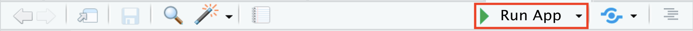

## Introduction

-   Github는 정적인 웹페이지만 지원하여 shiny application 구현이 어렵고 속도도 느립니다.
-   Posit사의 shinyapp.io(<https://www.shinyapps.io/Shinyappio>)는 shiny application의 지원하며 소규모에서는 무료입니다.,
-   이 hands-on에서는 API 기능이 있는 간단한 Shiny Application을 만들고, 이를 shinyapp.io에 게시까지 진행합니다.

::: {.callout-note title="1단계 Shiny Application 프로젝트 만들기" collapse="true" appearance="minimal"}
-   RStudio/File 메뉴에서 `New Project...` 메뉴 선택
-   `New Directory`에 생성되도록 선택
-   Project type은 `Shiny Application`를 선택
-   상위폴더가 `C:/Projects`인지 확인 (=Global Options 사전 지정값)
-   Directory name은 `R-4.4.1-Shiny_API_Application_Example`로 지정
-   [x] Create a git repository: 체크 유지하여 버전관리 적용
-   [x] Use renv with this project: 체크 유지하여 패키지 독립관리 적용
-   [ ] Open in new session: 다른 프로젝트를 열어놓고 진행한다면 체크하셔야 합니다.
-   프로젝트 폴더에 app.R 파일이 생성되어 있으며, 열어보면 아래의 기본예제코드가 보입니다.

```{r ShinyDefault, eval=FALSE, filename="app.R"}
# This is a Shiny web application. You can run the application by clicking
# the 'Run App' button above.
#
# Find out more about building applications with Shiny here:
#
#    https://shiny.posit.co/
#

library(shiny)

# Define UI for application that draws a histogram
ui <- fluidPage(

    # Application title
    titlePanel("Old Faithful Geyser Data"),

    # Sidebar with a slider input for number of bins 
    sidebarLayout(
        sidebarPanel(
            sliderInput("bins",
                        "Number of bins:",
                        min = 1,
                        max = 50,
                        value = 30)
        ),

        # Show a plot of the generated distribution
        mainPanel(
           plotOutput("distPlot")
        )
    )
)

# Define server logic required to draw a histogram
server <- function(input, output) {

    output$distPlot <- renderPlot({
        # generate bins based on input$bins from ui.R
        x    <- faithful[, 2]
        bins <- seq(min(x), max(x), length.out = input$bins + 1)

        # draw the histogram with the specified number of bins
        hist(x, breaks = bins, col = 'darkgray', border = 'white',
             xlab = 'Waiting time to next eruption (in mins)',
             main = 'Histogram of waiting times')
    })
}

# Run the application 
shinyApp(ui = ui, server = server)
```

-   @fig-RunApp 에서 보이는 `Run App` 버튼을 틀릭하여 코드를 실행시켜보면 Output/Viewer pane에서 자신의 로컬컴퓨터 상에서 웹 어플리케이션이 실행되는 것을 확인할 수 있습니다.

{#fig-RunApp}

 - 실행된 application의 왼쪽 사이드에 있는 `Number of bins`을 욺직이면 우측 히스토그램에서 x축 간격이 달라짐을 보실 수 있습니다.
:::

```{r Directory_name, eval=FALSE, filename="Creat Shiny Application message box"}
R-4.4.1-Shiny_API_Application_Example
```

::: {.callout-note title="2단계 App.R 파일을 API 코드로 대체하기" collapse="true" appearance="minimal"}
-   건강보험심사평가원_진료행위정보서비스API 중 행위요양기관종별통계를 추출한 것입니다.
-   아래의 코드를 app.R 파일에 복사하여 붙여넣기 하시면 됩니다.

```{r API_example, eval=FALSE, filename="app.R"}

################################################################################
## API data download
################################################################################
library(rjson)
library(httr)

# API 호출 정보 설정
base_url <- "http://apis.data.go.kr/B551172/getDiagnosisRemoteCancerous"
call_url <- "AllCancerRemoteOccurrenceTrend"
method <- "GET"

My_API_Key <- "wqdX2OnQY29zYQ7BXsGafDqVNaIbIYUoqAqS1bOeK6/yyqdukiVcRcj25wue+U8tqSaSXThVPwfaWDNpUc6cwQ=="
# 요청 파라미터 설정
params <- list(
  serviceKey = My_API_Key,  # 실제 API 키로 변경
  pageNo = 1,
  numOfRows = 10,
  resultType = "json"
)

# API 호출
url <- paste0(base_url, "/", call_url)
response <- GET(url, query = params)

# 응답 상태 확인
# if (http_status(response) == 200)
if (status_code(response) == 200)  {
  # JSON 데이터 파싱
  print(response)
  str(response)
  
} else {
  print(paste("API 호출 실패:", status_code(response)))
}

json_text <- content(response, as = "text")
print(json_text)
print("------------------")

data <- fromJSON(json_text)
print(data)

# 예시: 리스트 내부에 있는 항목을 추출하여 데이터프레임으로 변환
data_list <- data$items  # 적절한 필드로 접근

# 데이터프레임으로 변환
df <- as.data.frame(do.call(rbind, lapply(data_list, as.data.frame)))

################################################################################
## ShinyApp
################################################################################

library(shiny)
library(ggplot2)

# Define UI for the application
ui <- fluidPage(

  # Application title
  titlePanel("API Data Vizualization with ShinyApp"),
  
  # Sidebar layout
  sidebarLayout(
    sidebarPanel(
      # Dropdown to select Y axis variable
      selectInput("y_var", 
                  "Choose Y-axis Variable:", 
                  choices = c("TOTAL", "VALUE"),
                  selected = "TOTAL")  # Default to TOTAL
    ),
    
    # Main panel to display the plot
    mainPanel(
      plotOutput("yearPlot")
    )
  )
)

# Define server logic to create the plot based on user selection
server <- function(input, output) {
  
  # Render the plot
  output$yearPlot <- renderPlot({

    # Plot using the selected Y variable
    ggplot(data = df, aes(x = YEAR, y = .data[[input$y_var]])) +
      geom_point() +
      labs(x = "Year", y = input$y_var)
  })
}

# Run the application 
shinyApp(ui = ui, server = server)
```

-   코드를 실행할 때에는 아래의 패키지들을 설치한 후 진행하셔야 합니다.

```{r rjson_install, eval=FALSE, filename="R Console pane"}
renv::install("rjson")
```

```{r httr_install, eval=FALSE, filename="R Console pane"}
renv::install("httr")
```

```{r ggplot2_install, eval=FALSE, filename="R Console pane"}
renv::install("ggplot2")
```

-   실행을 하면 아래와 같은 화면이 나타납니다.

{#fig-api-shiny}
:::

::: {.callout-note title="3단계 shinyapp.io 가입 및 계정 연결하기" collapse="true" appearance="minimal"}
-   가입에 필요한 정보는 아래와 같습니다. 저는 예시로 아래와 같이 사용하였습니다.

    -   이메일 주소: rpythonmember\@gmail.com
    -   First Name: Member
    -   Last Name: RPython
    -   비밀번호: ????????

-   ACCOUNT SETUP이 나타나며 자신의 계정이름을 지정한다고 생각하시면 됩니다.

-   다른 사람의 계정이 일치하면 사용할 수 없습니다. 저는 예시로 rpythonmember로 지정하였습니다.

-   GETGTING STARTED 화면에서Start with R의 지시사항을 따라서

-   STEP 1 - INSTALL RSCONNECT

    -   우리는 renv 패키지 독립관리를 사용하고 있으므로 아래와 같이 설치하시면 됩니다.

    ```{r rsconnect_install, eval=FALSE, filename="R Console"}
    renv::install("rsconnect")
    ```

-   STEP 2 - Authorize Account

    -   shinyapp.io에서 만들어지는 token과 secret를 Account name과 함께 아래와 같이 setting 하도록 합니다.

```{r rsconnect_setAccount, eval=FALSE, filename="R Console"}
rsconnect::setAccountInfo(name='rpythonmember',
			  token='30C62ECC7B098C7B6B8EFABAF00D8AAE',
			  secret='<SECRET>')
```

-   아무런 메세지가 출력되지 않으면 연결된 것입니다.
-   위의 개념은 renv로 독립적인 패키지 관리를 하지 않을 때입니다. 우리는 프로젝트마다 독립적인 패키지 관리를 하기 때문에 shiny application 프로젝트마다 rsconnect를 해야 합니다.
:::

::: {.callout-note title="4단계 publishing 하기" collapse="true" appearance="minimal"}
-   Source pane 우측 타이틀바의 `Publish` 버튼을 클릭하면
-   파일 중 `app.R`만 publish 하도록 선택하고
-   Account 중 우리가 만든 `rpythonmember`로 선택하고
-   Title은 원하는데로 기술하면 됩니다. 저는 예제로 \`Shiny_API_Application_Example"를 기입하였습니다.
-   `Publish` 버튼을 클릭하면 shinyapp.io로 한참을 기다리면 publish가 되며 - browse가 클릭된 경우 자신의 web browse에 로딩이 되어 확인할 수 있습니다. - shinyapp.io에서는 Dashboard의 Application에 Running으로 확인할 수 있습니다.
-   최종확인은 인터넷창에 다음의 주소를 기입하여 확인할 수 있습니다.
:::

```{r confirm_at_browser, eval=FALSE, filename="internet browser"}
https://rpythonmember.shinyapps.io/Shiny_API_Application_Example/
```
