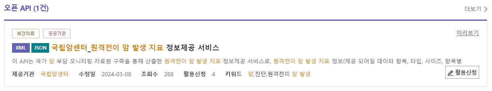
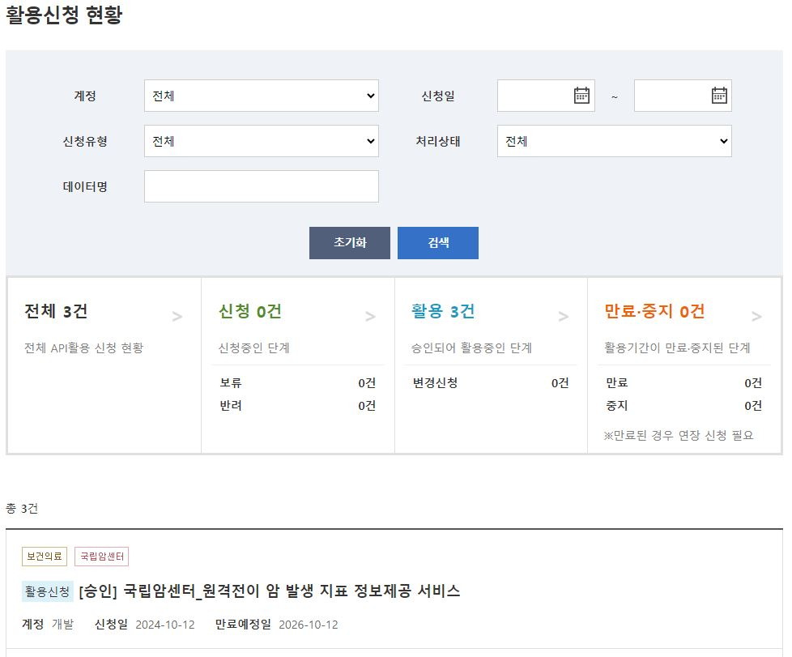
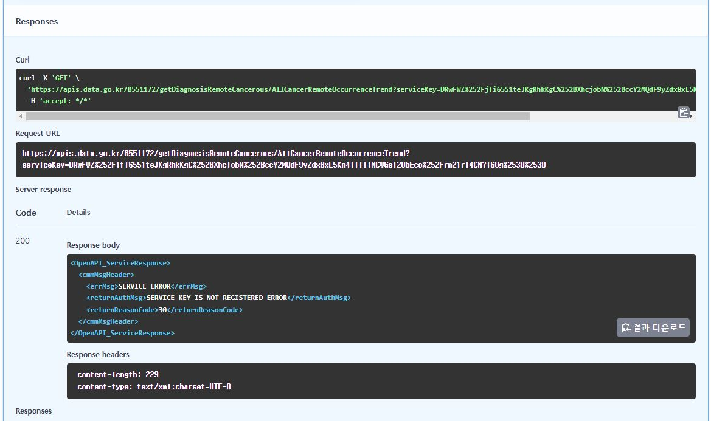
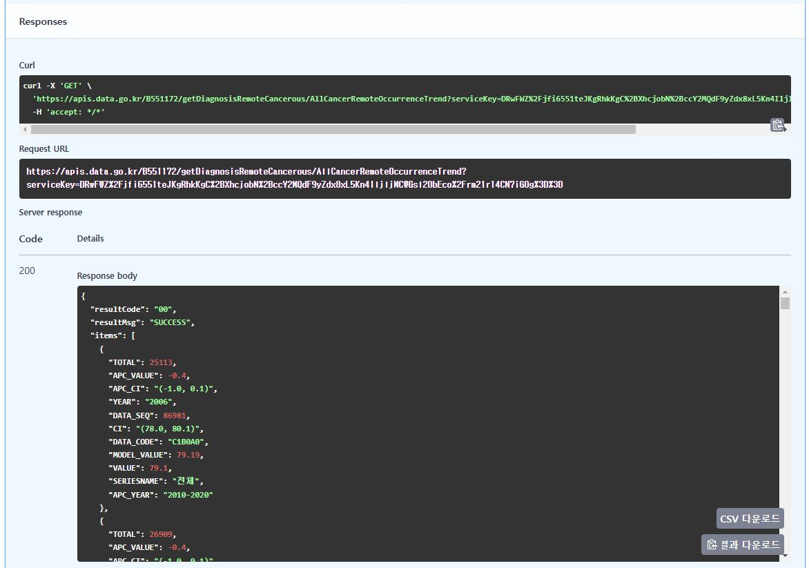

## 공공데이터(Open Govement Data)란?

공공데이터포털(<https://www.data.go.kr/index.do>)은 공공기관이 생성 또는 취득하여 관리하고 있는 공공데이터를 한 곳에서 제공하는 통합 창구입니다.
포털에서는 국민이 쉽고편리하게 공공데이터를 이용할 수 있도록 파일데이터, 오픈API, 시각화 등 다양한 방식으로 제공하고 있으며, 누구라도 쉽고 편리한 검색을통해 원하는 공공데이터를 빠르고 정확하게 찾을 수 있습니다.

## 회원가입

-   가입 단계 중에 스마트폰 등의 본인 인증이 필요합니다.
    -   알파이썬연구회는 사업자등록번호가 없으므로 기업회원으로도 가입하지 않았습니다.
    -   따라서 공공데이터를 활용하기 위해서는 연구회분들이 직접 회원가입을 하셔야 합니다.

## 원하는 API 찾기

-   "국립암센터 원격전이 암발생 지표"를 검색하시면 @fig-API_list 와 같이 목록을 쉽게 얻을 수 있습니다.

-   검색은 한글만 지원하는 것 같습니다.

{#fig-API_list}

## 활용신청

-   API를 사용하기 위한 목적을 기재하고 신청합니다.

    -   (이를 `개발계정`을 신청한다고도 합니다.)

-   다음단계로 활용신청 현황을 @fig-API_status 와 같이 확인할 수 있습니다.

{#fig-API_status}

-   저자의 경우 이전에 2건을 신청했었기 때문에 활용 3건으로 조회 됩니다. 원하는 목록을 선택하여 진행합니다.

## 인증키 확인하기

-   개발계정 상세보기를 통해 아래의 정보들을 확인할 수 있습니다.

-   기본정보

    -   서비스유형은 대부분 REST(Representational State Transfer)로 되어 있으며,
        -   지금 단계에서는 REST란 웹 자원(데이터, 서비스 등)을 클라이언트(=application)와 서버(=program) 간에 효율적으로 전송하고 관리하기 위해 HTTP 프로토콜을 사용하는 아키텍처 스타일로 간단하게 이해하시면 됩니다.

-   서비스정보

    -   데이터 포멧: XML+JSON,

        -   우리가 얻고자 하는 REST의 웹자원에 해당하면 다양한 유형의 자료를 유연하게 전달하기 위한 자료형식을 선택하고 있다고 이해하시면 됩니다.

    -   End Point:

        -   API에서는 이 주소를 통해 데이터를 요청하고 응답을 받을 수 있습니다.

    -   일반 인증키:

        -   사용자 식별과 보안목적이며,

        -   Encoding과 Decoding 인증키 2개가 있는데

        -   다소 황당할 수 있지만 어떤 것이 유효할지 사용자가 테스트하여 선택해야 합니다.

-   활용신청 상세기능정보

    -   원하는 상세기능의 미리보기를 선택하면

    -   요청변수(Request Parameters)를 볼 수 있습니다.
        HTTP 프로토콜에서 사용자의 요청을 퀴리로 전달하는 방식입니다.

        -   서비스 인증키: 이 항목에는 일반 인증키를 입력하면 되고 아직은 encoding 키와 decoding 키 둘 다 작동함을 알 수 있습니다.

        -   페이지 번호: XML 등에서 전달하고자 하는 자료의 양이 많을 떄 페이지를 분할하여 전달하기 때문이며, 총페이지수, 현재페이지번호 등의 정보를 이용해서 조회할 수 있습니다.

        -   한 페이지 결과 수: 한 번의 요청에서 받을 수 있는 데이터의 개수를 정의하는 설정입니다.

        -   기타의 변수들도 지정이 되어있으며 이는 API 마다 다릅니다.
            여기에서는 요청데이터 타입이 xml로 지정하여 진행해 봅니다.

    -   미리보기를 실행하면 별도의 웹브라우저창이 열리면서 요청변수에 의한 결과가 XML 형태로 보여집니다.

        -   가장 상위에 **Root Tag**가 보여집니다.
            여기에서는 **\<api Response\>** 형태로 작성되었으며 전체 데이터를 감싸는 역할을 합니다.

        -   다음 수준에서는 **메타데이터 태그 (Metadata Tag)**가 보여집니다.
            요청에 대한 **상태 정보, 요청 결과의 요약 정보** 등을 포함되며 여기에서는 HTTP 응답 상태로써 **\<resultCode\>**와 **\<resultMsg\>, \<totalCount\>, \<pageNo\>, \<numOfRows\>**가 보입니다.

        -   보다하위에는 \<item\>이라하여 실제 데이터부분이 있으며 요청변수에 근거하여 반환되는 값들이 항목별로 포함되어 있습니다.

## base URL 확인하기

-   개발계정 상세보기에서 기본정보의 데이터명에 있는 상세설명 버튼을 클릭하여 이동할 수 있습니다.

-   활용명세 내에서는 중단에 base URL을 제공하고 있습니다.

-   개발계정에서의 End Point와 주소가 같습니다.

-   굳이 해석해보자면 개발계정입장에서의 End Point가 API 목록을 연결할 때에는 base URL로 작용한다고 생각해도 무방할 듯 합니다.

## API 목록별 url 확인하기 (=end point)

-   API 목록

    -   원하는 데이터를 선택하기 위한 url이 추가로 제공됩니다.
    -   해당 목록에는 복사버튼까지 제공됩니다.

## 작동하는 인증키 확인하기

```         
-   클릭하여 선택하면 OpenAPI 실행준비를 할 수 있습니다 (테스트를 해 볼 수 있다는 의미입니다).
    -   OpenAPI 실행준비 버튼을 클릭해야 요청변수를 지정해 볼 수 있습니다.

    -   serviceKey \* required는 필수적으로 지정해야 한다고 안내가 있으며 앞서의 Encoding과 Decoding 중 하나씩 테스트를 해 보아야 합니다.

    -   여기에서는 Encoding을 선택하여 진행해서 openAPI 버튼을 클릭해서 진행해보면 아래의 그림과 같이 `SERVICE_KEY_IS_NOT_REGISTERED_ERROR` 오류메세지가 발생하고 적절한 결과를 얻을 수 없습니다. 즉 이 API 목록의 경우에서 Encoding 키는 정상작동을 하지 않는 것을 확인한 것입니다.
```



-   이제 Decoding 키를 선택하여 진행해 보면 아래와 같이 `SUCCESS` 메세지가 포함된 결과를 얻을 수 있습니다.



-   serviceKey에 대한 테스트는 완료되었고, 항후의 R 또는 Python에서 활용하고자 할 때, 작동하는 인증키를 사용하시면 됩니다.

-   

    ```         
    기타 parameters에 대한 테스트는 원하는 만큼 하시면 됩니다.
    ```

## 예제 R 코드

-   건강보험심사평가원_진료행위정보서비스 API를 호출하여 그래프를 그려주는 예제코드입니다..
-   HK010은 FDG PET/CT 검사를 의미합니다.
-   response는 200이면 성공적으로 호출되었음을 의미합니다.
-   data는 json 형식으로 받아온 데이터를 R에서 사용할 수 있도록 변환한 것입니다.
-   data_list는 data에서 필요한 부분만 추출한 것입니다.
-   df는 data_list를 데이터프레임으로 변환한 것입니다.
-   barplot base 함수로 그래프를 그리도록 구현되었습니다.
-   실행결과 그래프는 코드블록 다음의 @fig-petct 입니다.

```{r}
#| label: fig-petct
#| fig-cap: "2023년도 FDG PET/CT 건수"
#| echo: true
#| message: false

library(rjson)
library(httr)
library(plyr)

download_api_data <- function() {
  base_url <- "http://apis.data.go.kr/B551182/mdlrtActionInfoService"
  call_url <- "getMdlrtActionByClassesStats"
  method <- "GET"
  My_API_Key <- "DRwFWZ/jfi6551teJKgRhkKgC+XhcjobN+ccY2MQdF9yZdx8xL5Kn4IljljMCWGsl2ObEco/rm21r14CN7iG0g=="  # 실제 API 키
  params <- list(
    serviceKey = My_API_Key,
    pageNo = 1,
    numOfRows = 10,
    resultType = "json",
    year = "2023",
    stdType = "1",
    st5Cd = "HK010"
  )
  
  # API 호출
  url <- paste0(base_url, "/", call_url)
  response <- GET(url, query = params)

  if (status_code(response) == 200) {
    json_text <- content(response, as = "text")
    data <- fromJSON(json_text)
    return(data)
  } else {
    print(paste("API 호출 실패:", status_code(response)))
    return(NULL)
  }
}

data <- download_api_data()
data_list<-data$response$body$items$item
df <- rbind.fill(lapply(data_list, as.data.frame))

barplot(df$totUseQty, 
        names.arg = df$diagCdNm)  # x축 레이블 설정
```
