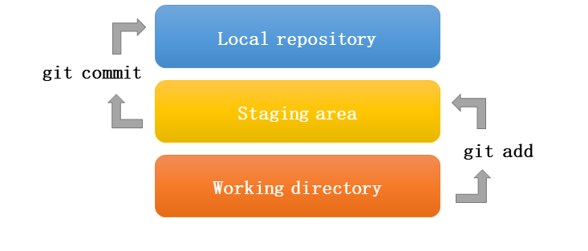
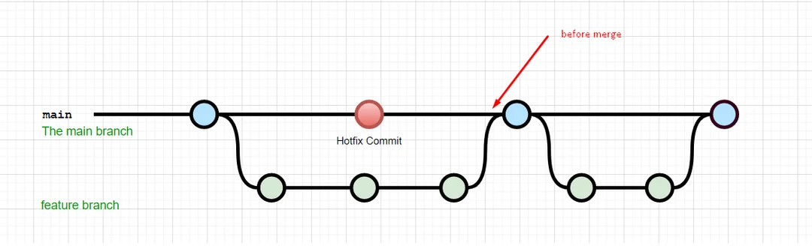
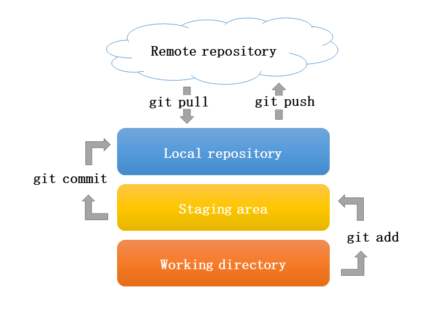

## Prologue

Git은 PC에서 개인 프로젝트의 버전을 단순히 관리하는 것을 넘어, 분산 환경에서 로컬(자신의 PC)과 원격 저장소(예: GitHub)를 활용하여 협업을 지원하는 오픈소스 분산형 버전 관리 시스템입니다. 그 결과, Git은 개발자에게 필수적인 도구가 됩니다.

하지만 초보자에게는 사용법이 다소 복잡해 보일 수 있습니다. 제 경험에 따르면, 초보자분들은 개인 프로젝트를 로컬 백업하고 GitHub 클라우드에 백업한다는 마음가짐으로 최소한의 기능만 사용해도 충분합니다.

물론, 때때로 최소한의 기능조차 원활하게 작동하지 않는 상황이 발생할 수 있습니다. 그러나 그런 경우 ChatGPT에 오류 메시지를 입력해 해결 방법을 찾아보는 과정을 통해 문제를 쉽게 해결할 수 있을 것입니다.

이 글은 Git의 설치, 설정, 기초 사용법, 그리고 Hands-on 실습에 앞서 Git의 핵심 개념을 이해하는 데 도움을 드리고자 작성되었습니다.

## Git 버전관리

Git 버전관리는 다양한 방식으로 구현될 수 있지만, 대표적인 방법은 각 버전을 기록하는 데이터베이스를 구성하는 것입니다. 여기서 \*\*스냅샷(snapshot)\*\*이라는 개념은, 특정 시점의 파일 전체 상태를 한 장의 사진처럼 기록하는 것을 의미합니다. Git은 빠른 개발 속도를 목표로 하므로, 각 버전의 파일 전체를 데이터베이스에 보관하되, 이전 버전과 중복되는 부분은 링크 등을 통해 재사용하여 최종 버전의 상태를 구성하는 방식을 채택했습니다. 이러한 재사용 메커니즘 덕분에 저장 공간이 절약되고, 작업 속도 또한 효율적으로 향상됩니다.

구체적으로, 버전 관리 대상으로 지정된 파일들의 스냅샷이 프로젝트 디렉토리 하부의 **.git** 숨김 디렉토리 내부의 **objects** 디렉토리에 저장됩니다. 이때 각 파일의 버전 이름은 SHA-1 해시값으로 생성되어, 이를 통해 파일의 버전이 식별되고 관리됩니다.

Git 버전관리의 특징 중 하나는 버전 관리를 위해 몇 가지 가상적인 단계를 도입했다는 점입니다. 일반적으로 개발자들은 프로젝트를 디렉토리 단위로 관리하며, Git 역시 디렉토리 단위로 작동합니다. 다만, 프로젝트의 모든 파일을 버전 관리 대상으로 포함하는 것이 아니라, 지정한 파일들만 관리합니다. 이를 구분하기 위해 Git은 **working directory**와 **staging area**라는 개념을 사용합니다.

-   **Working Directory:** 현재 프로젝트 파일들이 실제로 위치한 물리적 디렉토리를 의미합니다.

-   **Staging Area:** 버전 관리 대상으로 지정된 파일들의 가상적인 집합 공간입니다. 즉, 파일을 버전 관리 대상으로 지정하면 해당 파일들이 staging area로 옮겨진다고 표현할 수 있습니다.

Git의 **.git 디렉토리** 개념은 다음과 같이 이해할 수 있습니다. Staging area에 버전 관리 대상으로 지정된 파일들이 실제로 수정 작업이 완료되면, 개발자는 이를 버전 관리하기로 결정하고 해당 파일들의 스냅샷을 물리적으로 별도의 저장소로 옮깁니다.

-   **.git 디렉토리:** 버전 관리 시점과 각 버전에 대한 설명 등 메타데이터와 함께 버전들의 스냅샷이 저장되는 물리적인 디렉토리입니다. 이 과정은 마치 데이터베이스처럼 각 파일의 상태와 변경 이력을 체계적으로 관리하는 역할을 하며, 이를 저장소(repository)라는 이름으로도 부릅니다.

이러한 가상적인 단계들로 옮겨가기 위해 사용하는 Git 명령어들은 다음과 같습니다.

-   **`git add <file>`**\
    Working Directory에 있는 변경된 파일들을 Staging Area로 옮겨, 버전 관리 대상으로 지정하는 명령어입니다.
-   **`git commit -m "메시지"`**\
    Staging Area에 있는 파일들을 스냅샷으로 기록하여, .git 디렉토리 내의 objects 디렉토리에 저장하는 명령어입니다. 이때 메시지를 통해 해당 버전에 대한 설명을 추가할 수 있습니다.

## Git branch 관리

Git은 여러 개발자들이 동시에 프로젝트를 진행할 수 있도록 지원하는 도구입니다. 이를 위해 Git은 **branch**라는 개념을 도입했습니다. 첨부된 그림을 보면, 메인 개발 흐름을 담당하는 **main branch**에서 특정 기능만 추가로 개발하기 위해 **feature branch**가 파생되고 있습니다.

-   **main branch**는 기존 흐름대로 계속 개발을 진행합니다.

-   **feature branch**에서는 특정 기능을 독립적으로 개발할 수 있습니다.

-   필요하다면 **hotfix commit**처럼 main branch에서 긴급 수정이 이뤄지기도 합니다.

-   이후 기능 개발이 완료되면, feature branch를 **merge**하여 main branch에 변경 사항을 통합합니다.

그림 속 빨간 화살표(**before merge**)는 병합 전의 시점을 나타냅니다. 이처럼 Git의 branch 구조를 활용하면, 여러 명이 동시에 다른 작업을 진행해도 충돌을 최소화하며 각각의 작업을 독립적으로 수행하고, 최종적으로 main branch로 병합하여 전체 프로젝트에 반영할 수 있습니다.

이러한 branch들이 파생시키고 main으로 병합하는 Git 명령어들은 다음과 같습니다.

이러한 branch들을 파생시키고 main으로 병합하기 위해서는, 보통 **`git branch`**, **`git checkout`**, **`git merge`** 등의 명령어가 사용됩니다. 예를 들어, \*\*`git branch feature`\*\*를 통해 새 브랜치를 생성하고, \*\*`git checkout feature`\*\*로 해당 브랜치로 전환하여 작업한 뒤, 작업이 완료되면 \*\*`git checkout main`\*\*으로 돌아와 \*\*`git merge feature`\*\*를 통해 main 브랜치로 병합할 수 있습니다.

## Git 원격저장소

신입 연구회 회원 여러분도 이제 Git 저장소의 기본 개념을 이해하셨으리라 생각합니다. 다음 단계로는 원격 저장소(Remote Repository)의 개념을 익히는 것이 중요합니다. 협업을 위해서는 클라우드 상에 프로젝트 파일이 공유되어야 하는데, 이는 여러분의 로컬에 있는 **.git 디렉토리**와 유사한 저장소가 중앙에 위치해 있다고 생각하면 이해하기 쉽습니다.

예를 들어, GitHub, GitLab, Bitbucket과 같은 플랫폼이 대표적인 원격 저장소입니다. 이들 플랫폼은 로컬 저장소에서 작업한 내용을 중앙 저장소에 업로드(**git push**)하거나, 다른 사람이 작업한 최신 변경 사항을 다운로드(**git pull**)하는 방식으로 협업을 지원합니다.

이처럼 원격 저장소는 개인의 **.git 디렉토리**와 동일한 기능을 수행하는 중앙 저장소 역할을 하며, 협업 환경에서 필수적인 도구로 활용됩니다. 초보자들은 협업의 기회가 사실상 없겠지만, 원격저장소는 최소한 클라우드 백업 역할도 하게 됩니다. (저자의 경우는 연구실 PC와 노트북을 오가며 RStudio 프로젝트를 진행하고 있는데, 동기화를 원격저장소를 거쳐서 하고 있습니다.)\

## 핵심개념 이외의 사항들

실제 Git을 사용하다 보면, 핵심 개념에서 다룬 명령어들만으로 모든 상황을 해결할 수 없다는 점을 당연히 경험하게 됩니다. 예를 들어, 로컬 저장소와 원격 저장소 간의 파일 버전이 일치하지 않아 강제로 동기화해야 하는 경우가 발생할 수 있고, branch의 히스토리가 달라 병합이 원활하게 이루어지지 않는 상황도 종종 있습니다.

이러한 문제들에 직면했을 때는, 기본 개념을 넘어 추가적인 학습이 필요하며, ChatGPT와 같은 도구를 활용하여 문제 해결 방법을 찾아보시는 것을 추천드립니다.

## 추가로 공부하면 좋은 사이트

Git 초기 설정에 앞서 Git에서 사용되는 개념과 용어를 이해하는 것이 좋습니다. Git 공식사이트의 한글매뉴얼(<https://git-scm.com/book/ko/v2/%ec%8b%9c%ec%9e%91%ed%95%98%ea%b8%b0-Git-%ea%b8%b0%ec%b4%88>)을 학습하시길 추천합니다.
