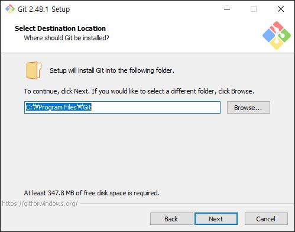
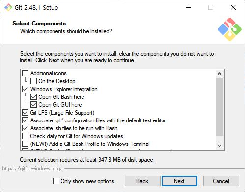
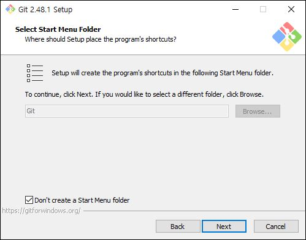
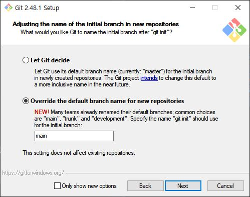
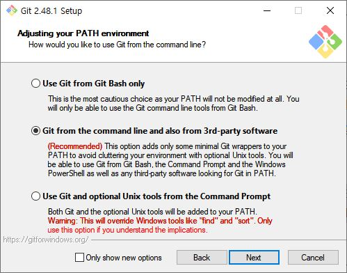

## 설치안내문서

Git 설치에 대한 공식문서(<https://git-scm.com/book/en/v2/Getting-Started-Installing-Git>)를 참고하는 것이 이상적이지만 , 아래의 요약을 참고하여 설치 하셔도 됩니다.

## Window에 설치하기

### 설치파일 다운로드

Git 공식다운로드사이트(<https://git-scm.com/downloads>)에서 자신의 운영체제에 적합한 최신 설치파일을 다운로드하고 설치합니다. 여기서는 Window에 설치하는 것이므로, - 2025년 2월 13일 배포된 윈도우용 64비트 최신 설치파일은 Git-2.48.1-64-bit.exe 입니다.

### 관리자권한으로 설치시작

설치를 시작하면 먼저 경로를 결정하게 되는데, 기본값인 `C:\Program Files\Git` 경로는 시스템폴더라서 설치하기 위해서는 관리자 권한이 필요합니다. (설치파일을 마우스 우클릭 하여 '관리자 권한으로 실행'을 선택하면 됩니다.)

### Select Destination Location (설치경로)

기본값은 `C:\Program Files\Git`이며 기본값을 추천합니다 @fig-DestinationLocation.

{#fig-DestinationLocation}

### Select Components (구성요소 선택)

@fig-Components 와 같이 기본값을 추천합니다.

{#fig-Components}

::: {.callout-note title="구성요소 세부설명" collapse="true" appearance="minimal"}
-   `[]Additional icons on the Desktop`은 바탕화면에 바로가기를 만드는 것
    -   연구회에서는 RStudio에서 Git를 직접 사용하므로 선택하지 않는 것을 추천
-   `[x]Windows Explorer integration`은 파일 탐색기에서 우클릭으로 다음의 Git 명령을 사용할 수 있도록 하는 것입니다.
    -   `[x]Open Git bash here`: 해당폴더에서 `Git Bash Terminal`을 열어주어 편리합니다.
    -   `[x]Open Git GUI here`: 해당폴더에서 Git의 Graphic User Interface를 열어주어 편리합니다.
    -   연구회에서는 주로 RStudio 내의 Terminal에서 Git 명령어를 사용하므로 반드시 필요한 것은 아니지만 기본값이므로 선택한 채로 진행하는 것을 추천합니다.
-   `[x]Git LFS (Large File Support)`
    -   자신의 PC에서 관리하던 프로젝트 파일들을 클라우드개념의 무료 Github 원격저장소에 올릴 때 파일크기의 제한이 있습니다. GitHub의 기본 저장소에서는 단일 파일의 크기를 100MB 이상 올릴 수 없도록 제한되어 있습니다. 이는 Git의 내부 구조와 GitHub의 사용 정책 때문인데요, 100MB 이상의 파일은 리포지토리의 성능 저하 및 관리상의 문제가 발생할 수 있기 때문입니다. 반면에 Git LFS (Large File Support) 옵션을 선택하면, 이러한 파일들을 별도의 저장소에 관리하게 되어 최대 2GB 크기의 파일까지 업로드가 가능해집니다. 다만, GitHub의 무료 플랜에서는 Git LFS 사용 시 1GB의 저장소와 1GB의 월간 대역폭 제한이 있으므로, 이 범위 내에서 큰 파일들을 관리해야 합니다.
-   `[x] Associate .git* configuration files with the default text editor`: Git의 설정파일인 `.gitconfig` 파일을 기본 텍스트 에디터로 연결하는 것
-   `[x] Associate .sh files to be run with Bash`: `.sh` 파일은 Windows의 Command Prompt 문법이 아닌 Unix 계열의 쉘 문법이 적용된 스크립트 파일입니다. Git Bash와 연동하면 해당 스크립트를 작성하거나 실행하기가 편리합니다.
-   `[] Check daily for Git for Windows updates`: Git for Windows의 업데이트를 자동으로 확인하는 것
-   `[] (New) Add a Git Bash Profile to Windows Terminal`: Windows Terminal은 윈도우에서 CLI를 구현한 가장 최신의 기능입니다. 여기에 Git Bash가 열릴 수 있도록 옵션을 추가하는 것을 의미합니다. 그러나 연구회에서는 RStudio에서 사용하므로 선택 치 않는 것을 추천합니다.
-   `[x] (New) Scalar (Git add-on to manage large scale repository)`: 새로운 기능으로 도움이 될 수 있으므로 선택을 추천합니다.
:::

### Select Start Menu Folder (시작메뉴폴더 선택)

원도우의 시작메뉴에서 보이게 될 폴더이름을 선택하는 것입니다. Studio에서 사용하면 굳이 시작메뉴에서 폴더를 만들 필요가 없으므로

-   [x] Don't create a Start Menu folder를 check하여 만들지 않는 것을 추천합니다 @fig-SelectingStartMenuFolder.

{#fig-SelectingStartMenuFolder}

### Choosing the default editor used by GIT (텍스트에디터 선택)

연구회는 Python IDE로 VS Code를 추천하고 있고 상대적으로 Vim보다 사용이 쉬우므로 이를 추천합니다 @fig-TextEditor.

{#fig-TextEditor}

### Adjusting the name of the initial branch in new repositories (기본 브렌치명)

-   [ ] Overide the default branch name for new repositories: 새로운 저장소를 생성할 때 기본 브렌치명을 변경할 수 있는 옵션입니다. 기본값은 master이며, 2020년 10월 1일부터 GitHub에서는 기본 브렌치명을 master에서 main으로 변경하였습니다. 이에 따라 Git 설치 시 기본 브렌치명을 main으로 설정하는 것을 추천합니다 @fig-DefaultBranchName.

{#fig-DefaultBranchName}

### Adjusting your PATH enviroment (환경변수 설정)

-   `[x] Git from the command line and also from 3rd party software`: 윈도우의 시스템 환경변수에 Git 실행 파일의 경로를 추가하는 것을 의미합니다. 이 옵션을 선택하면 Windows의 Command Prompt, PowerShell 등에서도 Git 명령어를 사용할 수 있고, RStudio 같은 타사 소프트웨어에서도 Git 경로를 자동으로 인식하므로 추천됩니다 @fig-PathEnviroment.

{#fig-PathEnviroment}

### Choosing the SSH executable (SSH 선택)

Git은 원격 저장소와의 안전한 통신을 위해 주로 SSH(Secured Shell)를 사용합니다. GitHub, GitLab, Bitbucket 등의 플랫폼은 SSH 키 기반 인증을 제공하여, 비밀번호 대신 SSH 키로 원격 저장소에 안전하게 접속할 수 있도록 지원합니다. OpenSSH는 오픈 소스 소프트웨어로, Git 설치 시 선택적으로 설치할 수 있으며, SSH 기반 인증 설정에 주로 사용됩니다. 설치 과정에서는 OpenSSH가 기본 선택 항목으로 제공되므로, 특별한 이유가 없다면 기본값을 그대로 사용하는 것이 권장됩

{#fig-OpenSSH}

### Choosing the HTTPS transport backend (SSL/TLS 라이브러리 선택)

SSL/TLS는 Git이 HTTPS 연결을 통해 원격 저장소와 통신할 때 사용하는 암호화 라이브러리입니다. OpenSSL은 더 넓은 암호화 기능과 최신 표준 지원, 리눅스와의 호환성이 중요한 경우 추천되며, Windows 고유 SSL/TLS 라이브러리(Schannel)는 Windows 시스템과의 통합과 간편한 설정을 원할 때 추천합니다. 연구회에서는 기본값인 OpenSSL을 추천합니다 @fig-OpenSSL.

{#fig-OpenSSL}

### Configuring the line ending conversions (줄바꿈 변환 설정)

윈도우에서는 줄바꿈 기본 설정이 **CRLF(Carriage Return Line Feed)**입니다. 반면, Unix 계열(리눅스, macOS)은 **LF(Line Feed)**를 사용합니다. 운영체제를 오가며 개발할 경우, Git은 이러한 줄바꿈 차이를 해결하기 위해 **줄바꿈 변환 기능(Line Ending Conversion)**을 지원합니다. checkout과 commit 시에 자동으로 줄바꿈을 변환할지 설정할 수 있는데, 기본값은 Checkout Windows-style, commit Unix-style line endings이며, 이는 Windows에서 개발할 때 적합한 설정입니다. Linux 또는 macOS에서 개발할 경우, Checkout as-is, commit Unix-style line endings를 선택하는 것이 좋습니다 @fig-LineEndings.

{#fig-LineEndings}

### Configuring the terminal emulator to use with Git Bash (터미널에뮬레이터 선택)

Git Bash에서 사용할 터미널 환경을 결정하는 옵션입니다. 각 옵션은 Git Bash가 실행될 때 사용할 터미널을 정의하며, 사용자 경험과 터미널 기능에서 차이가 있습니다. MinTTY는 더 발전된 터미널 경험을 제공하며, 유닉스 스타일에 가까운 작업 환경을 제공합니다. 특히, 리눅스/유닉스에 익숙한 사용자나 Git Bash를 주로 사용하는 경우 적합합니다. Windows 기본 콘솔 창은 Windows에서 기본 제공되는 터미널 인터페이스로, CMD와 같은 익숙한 환경을 선호하는 사용자에게 적합합니다. 특히, Windows 사용자나 CMD를 주로 사용하는 경우 적합합니다 @fig-TerminalEmulator.

{#fig-TerminalEmulator}

### Choose the default behavior of 'git pull\` (git pull 기본동작방식 설정)

이 설정은 git pull 명령을 실행했을 때, 로컬 브랜치와 원격 브랜치 간의 변경 사항을 어떻게 병합할지를 결정합니다 @fig-GitPull.

1\. Fast-forward or merge (기본 설정) 이 옵션은 기본값으로 설정되어 있으며, Git이 상황에 따라 fast-forward 병합 또는 **병합 커밋(merge commit)**을 선택합니다.

Fast-forward: 만약 로컬 브랜치에서 추가적인 변경 사항이 없고, 단순히 원격 브랜치의 커밋을 가져와서 이어 붙일 수 있는 경우, Git은 fast-forward 병합을 수행합니다. 이 경우 병합 커밋이 생성되지 않고, 기존 커밋의 연속선 상에 새로운 커밋이 추가됩니다.

장점: 이력이 깔끔하게 이어져서, 불필요한 병합 커밋 없이 간결한 로그를 유지할 수 있습니다.

단점: 협업 중 복잡한 병합 기록을 관리하는 데는 한계가 있을 수 있습니다.

Merge: 로컬 브랜치에 변경 사항이 있거나, 원격 브랜치의 변경 사항을 단순히 이어 붙일 수 없는 경우에는 **병합 커밋(merge commit)**이 생성됩니다. 이 커밋은 두 브랜치의 이력을 병합하면서, 병합 지점을 명확하게 표시합니다.

장점: 병합이 발생한 지점을 명확하게 구분할 수 있어, 누가 어떤 작업을 했는지 추적하기 쉽습니다.

단점: 병합 커밋이 많아지면 로그가 복잡해질 수 있습니다.

2\. Rebase Rebase 옵션은 원격 브랜치의 변경 사항을 로컬 브랜치에 병합 커밋 없이 적용하는 방식입니다. Rebase는 커밋을 재정렬하여 마치 원격 브랜치에서 작업한 것처럼 히스토리를 재작성합니다.

Rebase 동작 방식: 로컬 브랜치에서 발생한 커밋을 잠시 제거한 후, 원격 브랜치의 변경 사항을 먼저 적용하고, 그 뒤에 로컬 커밋을 재적용합니다. 이렇게 하면 이력이 직선으로 이어져, 커밋 로그가 매우 깔끔해집니다.

장점: 히스토리가 간결하고, 직선으로 정렬되어 있어, 로그를 읽기가 쉽습니다. 병합 커밋이 생기지 않기 때문에, 협업 중에도 깔끔한 이력을 유지할 수 있습니다.

단점: Rebase는 히스토리를 재작성하는 방식이므로, 이미 공유된 커밋을 rebase하게 되면 협업 중 충돌이 발생하거나 다른 개발자들의 커밋에 영향을 줄 수 있습니다. 협업 중에는 신중하게 사용해야 하며, 특히 다수의 개발자가 동시에 작업하는 브랜치에서는 rebase가 문제가 될 수 있습니다.

3\. Only ever fast-forward Only ever fast-forward 옵션은 강력한 제약 조건을 설정하여, 항상 fast-forward 병합만 허용하는 방식입니다. 이 옵션을 선택하면 Git은 병합 커밋을 생성하지 않고, fast-forward가 가능한 경우에만 병합을 수행합니다.

동작 방식: 로컬 브랜치가 원격 브랜치보다 앞서거나 충돌이 발생할 경우, 병합을 허용하지 않고 에러를 발생시킵니다. 즉, 단순히 브랜치가 원격 브랜치보다 뒤에 있을 때만 fast-forward 병합이 가능합니다.

장점: 이력을 절대적으로 깔끔하게 유지할 수 있습니다. 병합 커밋이 생기지 않기 때문에, 히스토리가 매우 간결하게 유지됩니다. 히스토리를 관리하기가 쉬우며, 직선형으로 깔끔하게 이어지는 커밋 로그를 선호하는 경우 적합합니다.

단점: 협업 중에 다른 개발자의 변경 사항과 로컬 변경 사항이 병합되어야 하는 경우에도 fast-forward만 허용하므로, Git이 병합을 거부할 수 있습니다. 이런 경우, 병합이 실패하고 수동으로 병합을 수행해야 할 수도 있습니다. 복잡한 협업 상황에서는 제약이 될 수 있습니다. 협업 중에는 병합 커밋이 필요할 수 있기 때문에, 이 옵션은 다소 제한적입니다.

{#fig-GitPull}

### Git Credential Manager (원격저장소 인증정보 저장도구 사용여부)

Git Credential Manager는 Git에서 원격 저장소에 대한 인증 정보를 안전하게 저장하고 자동으로 관리해주는 도구입니다. 이를 통해 사용자는 자격 증명을 반복적으로 입력할 필요 없이 안전하게 Git을 사용할 수 있으며, Windows, macOS, Linux 등 다양한 운영체제에서 지원됩니다. OAuth, 토큰 기반 인증 등 최신 인증 방식도 지원하여 보안성과 편리성을 모두 제공합니다. Git Credential Manager는 Git 설치 시 선택적으로 설치할 수 있으며, 기본값을 사용하는 것이 권장됩니다 @fig-GitCredentialManager.

{#fig-GitCredentialManager}

### Configuring extra options

-   `[x] File System Caching`: 은 Git이 파일 시스템에 대한 **메타데이터(파일 상태, 권한, 타임스탬프 등)**를 더 빠르게 조회할 수 있도록 캐시를 사용하는 기능입니다. 기본적으로, Git은 파일 시스템에서 파일 변경 사항을 확인하기 위해 파일의 상태(예: 수정 시간, 크기)를 체크합니다. 이 과정이 많은 파일을 포함하는 대형 프로젝트에서는 성능 저하를 일으킬 수 있습니다.
-   \[\] Symbolic Links(심볼릭 링크): 파일이나 디렉토리에 대한 참조를 가리키는 특별한 유형의 파일입니다. 심볼릭 링크는 원래 파일 또는 디렉토리의 경로를 저장하고, 이를 참조하는 방식으로 동작합니다. Git에서 Symbolic Links 옵션을 활성화하면, Git은 심볼릭 링크를 파일로 저장하는 대신, 심볼릭 링크 자체를 저장하고 관리할 수 있습니다. 리눅스 및 macOS에서 심볼릭 링크는 많이 사용되고 지원되므로, 이 옵션을 활성화하는 것이 일반적입니다. Windows에서는 심볼릭 링크가 기본적으로 제한되어 있으며, 활성화하려면 관리자 권한이나 특정 설정을 필요로 합니다. 따라서, Windows에서 이 옵션을 활성화하면 제대로 동작하지 않거나 예기치 않은 동작이 발생할 수 있습니다.
-   기본값은 File System Caching 활성화입니다 @fig-ExtraOptions.

{#fig-ExtraOptions}

### 설치확인

커맨드창에서 아래의 명령을 실행하여 버전을 확인하시면 됩니다. (Git 설치 시 실행파일의 경로가 환경변수에 자동으로 등록되기 때문에 커맨드창을 여는 폴더위치가 관계 없이 버전이 표시되어야 합니다.)

```{r git_installation, eval=FALSE, filename="Command Prompt"}
git --version
```

## WLS2/Ubuntu 환경에 설치하기

### Git 공식 PPA(Personal Package Archive) 사용 업데이트

#### 기존 Git 버전 확인
```{r git_version, eval=FALSE, filename="bash"}
git --version
```

#### 필수 패키지 설치
```{r git_install, eval=FALSE, filename="bash"}
sudo apt update
sudo apt install software-properties-common
```

#### Git 공식 PPA 추가
```{r git_ppa, eval=FALSE, filename="bash"}
sudo add-apt-repository ppa:git-core/ppa
```

#### 패키지 목록 업데이트 후 Git 설치/업그레이드
```{r git_install_upgrade, eval=FALSE, filename="bash"}
sudo apt update
sudo apt install -y git
```

#### 업데이트 확인
```{r git_version_check, eval=FALSE, filename="bash"}
git --version
```