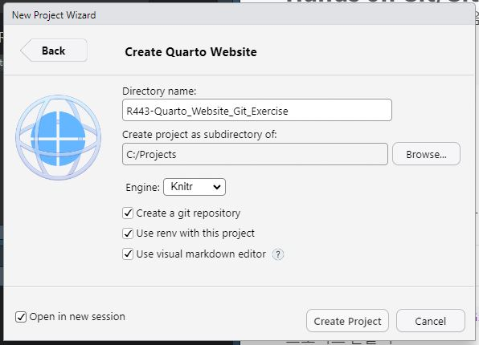

1단계: Git이 RStudio에서 사용가능한지 확인하기

::: {.callout-note title="1단계 예시" collapse="true" appearance="minimal"}
-   RStudio Terminal tab에서 아래의 git 명령어를 실행하여 설치된 최신 version이 맞는지 확인합니다.

```{r git_install_verfication, eval=FALSE, filename="RStdio Terminal tab"}
git --version
```

-   오류가 있다면
    -   Global Options... Git/SVM 메뉴에서 version control interface for RStudio가 check 되어있는지,
    -   git 실행파일의 경로가 제대로 인식되어 있는지
-   등을 확인하여 오류를 해결하고 진행 하시길 바랍니다.
:::

2단계: `R` 버전이 `x.y.z`일때 `Git_Exercise`가 프로젝트명에 포함되도록 Quarto Website 프로젝트 만들기

::: {.callout-note title="2단계 예시" collapse="true" appearance="minimal"}
-   `RStudio>File` 메뉴에서 `New Project`를 선택
-   `New Directory`를 선택
-   `Project type`으로서 `Quarto Website`를 선택
-   @fig-NewProject 처럼 `C:/Projects` 하부에 생성되는지 확인
-   Directory name으로 `Rxyz-Quarto_Website_Git_Exercise` 입력
-   [x] Create a git repository: 이 프로젝트에 Git 버전관리 적용하기 위해서는 체크를 해야함
-   [x] Use renv with this project: 독립적인 패키지 관리를 적용하기 위해서는 체크를 해야함
-   [x] Use visual mode markdown editor: 체크를 추천
-   [x] Open in new session: 다른 session을 열어두고자 한다면 체크를 해야함
-   `Create Project` 버튼클릭

```{r git_example, eval=FALSE, filename="recommeded project name"}
Rxyz-Quarto_Website_Git_Exercise
```

{#fig-NewProject}
:::

3단계: `.gitignore` 파일을 열어서 Git 버전관리 예외로 설정된 파일/폴더 목록 확인하기

::: {.callout-note title="3단계 예시" collapse="true" appearance="minimal"}
-   Git 버전관리를 할 때, 프로젝트파일들에서 무조건 제외하면 좋은 파일들이 있습니다.
    예를 들어서 RStudio에서 생성되는 `.Rproj.user`, `.Rhistory`, `.RData`, `.Ruserdata` 파일들의 경우는 버전관리를 할 필요가 당연히 없기 때문입니다.
    이러한 경우를 위해서 Git에서는 버전관리에서 무조건 제외하는 파일들을 .gitignore라는 숨김파일로 관리하고 있습니다.
    실제적으로는 매우 중요한 파일이므로 잘 설정해서 버전관리를 효율적으로 해야 하므로 반드시 이해하고 넘어가야 할 파일입니다.

-   Output pane Files 탭에서 `.gitignore` 파일을 열면 다음과 같이 기록되어 있습니다.
    이것은 기본적으로 Quarto Website 프로젝트를 만들때는 제외하도록 설정되어 있습니다.

```{r gitignore, eval=FALSE, filename=".gitignore"}
.Rproj.user
.Rhistory
.RData
.Ruserdata
```
:::

4단계: `git status` 실행하여 branch 이름과 untracked file 목록을 확인하기

::: {.callout-note title="4단계 예시" collapse="true" appearance="minimal"}
```{r git_status, eval=FALSE, filename="RStudio Terminal tab"}
git status
```

```{r git_status_output, eval=FALSE, filename="git status output"}
C:\Projects\R443-Quarto_Website_Git_Exercise>git status
On branch main

No commits yet

Untracked files:
  (use "git add <file>..." to include in what will be committed)
        .Rprofile
        .gitignore
        R443-Quarto_Website_Git_Exercise.Rproj
        _quarto.yml
        about.qmd
        index.qmd
        renv.lock
        renv/
        styles.css

nothing added to commit but untracked files present (use "git add" to track)
```

-   Git status 명령은 Git 버전관리상태를 알고자 할 때 사용하는 Git 명령어입니다.
-   이 명령으로 발생하는 메세지를 반드시 다 이해해야 Git를 사용할 수 있는 것은 아니지만 Git 버전관리에 따른 파일의 상태를 실제 메세지에서는 어떻게 표현하는지 알아보기 위해 메세지 구성별로 알아보도록 하겠습니다.
-   **On branch main**\
    현재 작업 중인 브랜치가 main임을 나타냅니다. 즉, 현재 main 브랜치에서 작업하고 있다는 의미입니다.
-   **No commits yet**\
    아직 커밋이 하나도 이루어지지 않았음을 보여줍니다.
-   **Untracked files:**\
    Git이 아직 추적하지 않는 파일들이 있다는 뜻입니다.
    -   괄호 안의 안내 메시지 (“use "git add \<file\>..." to include in what will be committed”)는 해당 파일들을 추적 대상으로 포함시키고 싶다면, `git add` 명령어를 사용하라는 의미입니다.

    -   목록에 나열된 파일들(예: .Rprofile, .gitignore, R443-Quarto_Website_Git_Exercise.Rproj 등)은 현재 Git이 관리하고 있지 않은 상태입니다.
-   **nothing added to commit but untracked files present (use "git add" to track)**\
    스테이지 영역에 추가된 파일은 없지만, 추적되지 않는 파일들이 존재함을 다시 한 번 요약해 줍니다. 이 경우, 커밋할 파일이 없으므로 아무 것도 커밋되지 않음을 알 수 있습니다.
-   주의사항: output pane의 Files탭에서 보이는 파일/폴더 목록과 untracked file들이 다름을 확인하시길 바랍니다.
-   Enviroment pan Git tab에서도 같은 결과를 보여줍니다. 파일/폴더는 Path 컬럼에 보여지고, Staged는 check되어 있지 않으며 Status는 모두 ?? 표시된 상태입니다.
:::

5단계: .Rprofile, Rproj 확장자인 모든 파일, renv 폴더를 버전관리대상에서 제외하기

::: {.callout-note title="5단계 예시" collapse="true" appearance="minimal"}
-   RStudio에서 `.gitignore` 파일을 열어서 아래의 내용을 추가합니다.

```{r gitignore_add, eval=FALSE, filename=".gitignore"}
.Rprofile
*.Rproj
renv/
```

-   .gitignore 파일을 저장하면 Envoriment pan Git tab에서 .gitignore에 추가했던 파일들이 제외되었음을 알 수 있습니다.
-   `git status` 명령을 실행하여 변경사항을 확인합니다

```{r git_status_output_ignore, eval=FALSE, filename="git status output"}
C:\Projects\R443-Quarto_Website_Git_Exercise>git status
On branch main

No commits yet

Untracked files:
  (use "git add <file>..." to include in what will be committed)
        .Rproj.user/
        .gitignore
        _quarto.yml
        about.qmd
        index.qmd
        renv.lock
        styles.css

nothing added to commit but untracked files present (use "git add" to track)
```

-   untracked file 목록에서 .gitignore에 추가했던 파일들이 제외되었음을 알 수 있습니다.
:::

6단계: untracked file들을 staged 상태로 만들기

::: {.callout-note title="6단계 예시" collapse="true" appearance="minimal"}
-   RStudio Terminal tab에서 `git add .` 명령어를 실행합니다.
-   `.`의 의미는 workiong directory의 모든 파일을 staging 영역으로 추가하겠다는 의미입니다.

```{r git_add, eval=FALSE, filename="RStudio Terminal tab"}
git add .
```

-   이 때 아래의 경고 메시지가 출력될 수 있습니다. 그러나 이는 Line Feed(LF)와 Carriage Return(CR)의 차이로 인한 경고이므로 무시하셔도 됩니다.

```{r git_add_output, eval=FALSE, filename="git add output"}
C:\Projects\R443-Quarto_Website_Git_Exercise>git add .
warning: in the working copy of '_quarto.yml', LF will be replaced by CRLF the next time Git touches it
warning: in the working copy of 'about.qmd', LF will be replaced by CRLF the next time Git touches itwarning:in the working copy of 'index.qmd', LF will be replaced by CRLF the next time Git touches itwarning: in the working copy of 'styles.css', LF will be replaced by CRLF the next time Git touches it
```

-   `git status` 명령을 실행하여 변경사항을 확인합니다

```{r git_status_output_add, eval=FALSE, filename="git status output"}
C:\Projects\R443-Quarto_Website_Git_Exercise>git status
On branch main

No commits yet

Changes to be committed:
  (use "git rm --cached <file>..." to unstage)
        new file:   .gitignore
        new file:   _quarto.yml
        new file:   about.qmd
        new file:   index.qmd
        new file:   renv.lock
        new file:   styles.css
```

-   git add . 명령어는 현재 디렉토리 및 모든 하위 폴더의 변경 사항을 staging 영역으로 추가하는 명령어입니다. 이는 새로 생성된 파일뿐만 아니라 수정된 파일도 staging 영역에 추가하게 됩니다.
-   커밋할 준비가 된 (=staging 된) 파일/폴더들의 목록이 git status 명령어를 통해 확인할 수 있으며, 여기서는 .gitignore, \_quarto.yml, about.qmd, index.qmd, renv.lock, styles.css 파일들이 staging 영역에 추가된 상태입니다.
-   staging 영역에 추가한 파일을 다시 제거하고 싶다면 git rm --cached <file> 명령을 사용해야 합니다. 이 명령은 staging에서만 해당 파일을 제거하며, 파일 자체는 그대로 유지됩니다.
-   Environment/git pane에서 refresh 버튼을 클릭하여 목록을 갱신하면, Staged에 체크된 파일들이 나타납니다. 또한, Status 열에 A(added)를 나타내는 표시가 있어 해당 파일들이 staging 영역에 추가되었음을 알 수 있습니다.
:::

7단계: `git commit -m "first commit"`를 실행하여 committed 상태로 만들기

::: {.callout-note title="7단계 예시" collapse="true" appearance="minimal"}
-   RStudio Terminal pane에서 아래의 명령어를 실행하고 결과를 확인합니다.

```{r git_commit, eval=FALSE, filename="RStudio Terminal tab"}
git commit -m "first commit"
```

```{r git_status_output_commit, eval=FALSE, filename="git status output"}
C:\Projects\R443-Quarto_Website_Git_Exercise>git commit -m "first commit"
[main (root-commit) 009849c] first commit
 6 files changed, 1037 insertions(+)
 create mode 100644 .gitignore
 create mode 100644 _quarto.yml
 create mode 100644 about.qmd
 create mode 100644 index.qmd
 create mode 100644 renv.lock
 create mode 100644 styles.css
```

-   `git commit -m "first commit"` 명령은 현재 staging 영역에 있는 변경 사항을 로컬 저장소에 저장(커밋)하고, "first commit"이라는 메시지를 커밋에 붙입니다.
-   root-commit: 이 부분은 프로젝트의 첫 번째 커밋임을 나타냅니다. root-commit은 해당 브랜치에서 이전 커밋이 없음을 뜻합니다.
-   6 files changed: 총 6개의 파일이 변경되었음을 의미합니다. 여기서는 처음 커밋이기 때문에 파일들이 추가되었다고 간주합니다.
-   1037 insertions(+): 총 1037개의 라인이 추가되었음을 의미합니다. 이는 새로운 파일들이 추가되었기 때문에 발생한 추가된 라인 수입니다.
-   create mode 100644: 파일이 추가됨을 나타냅니다. 100644는 파일의 권한을 의미하며, 읽기/쓰기 가능한 일반 파일이라는 의미입니다.
-   Environment/git tab에서는 파일들이 모두 사라짐을 알 수 있습니다.
-   `git status` 명령으로 변경사항을 확인합니다.

```{r git_status_commit, eval=FALSE, filename="RStudio Terminal pane"}
git status
```

```{r git_status_commit_output, eval=FALSE, filename="git status output"}
C:\Projects\R443-Quarto_Website_Git_Exercise>git status
On branch main
nothing to commit, working tree clean
```

-   커밋 후 변경사항이 없는 상태로 "nothing to commit, working tree clean"이 출력됩니다.
-   git log 명령어를 통해 커밋 이력을 확인할 수 있습니다.

```{r git_log, eval=FALSE, filename="RStudio Terminal pane"}
git log
```

```{r git_log_output, eval=FALSE, filename="git log output"}
C:\Projects\R443-Quarto_Website_Git_Exercise>git log
commit 009849c1515ab1cc55c04b0ade088e46ec32953e (HEAD -> main)
Author: RPythonMember <rpythonmember@gmail.com>
Date:   Sat Mar 22 00:10:08 2025 +0900

    first commit
```

-   git log 명령어를 통해 커밋 이력을 확인할 수 있습니다. 여기서는 커밋 메시지와 커밋한 시간, 커밋한 사람의 정보가 출력됩니다.
:::

8단계: Github에 `Quarto_Website_Git_Exercise`이란 원격저장소 만들기

::: {.callout-note title="8단계 예시" collapse="true" appearance="minimal"}
-   Github 공식사이트(<https://github.com/>)로 접속합니다.
-   직전의 메뉴에서 Github에 가입을 했다고 가정하고, SSH키를 이용한 자동접속이 되도록 이미 설정이 완려되었다고 가정하고 진행하겠습니다. 혹시라도 되지 않았다면 완료 후 접속하시길 바랍니다.
-   자동접속 이후, Create New Repository 창에 `Repository name`에 `Quarto_Website_Git_Exercise를`입력하고원격저장소의 유형을 private가 아닌 public을 선택하여 진행합니다.

```{r github_signup, eval=FALSE, filename="create new repository"}
Quarto_Website_Git_Exercise
```
:::

9단계: 로컬과 원격저장소를 연결하기

::: {.callout-note title="9단계 예시" collapse="true" appearance="minimal"}
-   Github \<\> code 메뉴에서 Quick setup 내에 있는 URL이 원격저장소 주소입니다. 이를 이용하여 Terminal pane에서 아래의 git 명령어를 실행하여 원격저장소를 연결합니다. (아래는 저자의 예시이므로 실습자는 반드시 자신의 주소로 아래의 명령을 해야 합니다.)

```{r git_remote, eval=FALSE, filename="RStudio Terminal pane"}
git remote add origin git@github.com:RPythonStudy/Quarto_Website_Git_Exercise.git
```

-   `git remote add origin`에서 origin은 원격 저장소의 이름(별칭)을 나타냅니다.
-   이후에 push나 pull 명령을 실행할 때 origin을 사용하여 원격 저장소를 지정할 수 있습니다.
-   아래의 명령으로 원격 저장소의 연결 상태를 확인합니다.

```{r git_remote_v, eval=FALSE, filename="RStudio Terminal pane"}
git remote -v
```

```{r git_remote_V_output, eval=FALSE, filename="git log output"}
C:\Projects\R443-Quarto_Website_Git_Exercise>git remote -v
origin  git@github.com:RPythonStudy/Quarto_Website_Git_Exercise.git (fetch)
origin  git@github.com:RPythonStudy/Quarto_Website_Git_Exercise.git (push)
```

-   fetch 원격 저장소에서 최신변경사항을 가져오는 명령어이며 위에서는 명기된 원격저장소에서 가져옴을 보여줍니다.
-   push 원격 저장소로 변경사항을 보내는 명령어이며 위에서는 명기된 원격저장소로 보냄을 보여줍니다.
:::

10단계: 로컬에 커밋된 사항들을 원격저장소로 push 하기

::: {.callout-note title="10단계 예시" collapse="true" appearance="minimal"}
-   Terminal tab에서 아래의 git 명령어를 실행하여 원격저장소를 연결합니다.

```{r git_push, eval=FALSE, filename="RStudio Terminal pane"}
git push origin main
```

-   `git push` 명령어는 로컬 저장소의 변경사항을 원격 저장소로 업로드합니다.
-   `origin`은 원격저장소의 별칭입니다.
-   `main`은 로컬의 원격저장소 이름입니다. 그리고 위 명령으로 로컬의 main 브랜치에서 원격저장소 main 브랜치로 push합니다. \`

```{r git_push_output, eval=FALSE, filename="git log output"}
C:\Projects\R443-Quarto_Website_Git_Exercise>git push origin main
Enumerating objects: 8, done.
Counting objects: 100% (8/8), done.
Delta compression using up to 4 threads
Compressing objects: 100% (7/7), done.
Writing objects: 100% (8/8), 16.11 KiB | 589.00 KiB/s, done.
Total 8 (delta 0), reused 0 (delta 0), pack-reused 0 (from 0)
To github.com:RPythonStudy/Quarto_Website_Git_Exercise.git
 * [new branch]      main -> main
```

-   Enumerating objects: 객체수 계산에서 특이한 사항은 커밋된 파일은 6개 였는데 여기서는 객체수는 2개가 더 큽니다. 이는 디렉토리구조 파일과 커밋정보파일이 추가되기 때문입니다.
-   Counting objects: Git이 객체를 전송할 준비가 되었음을 나타냅니다.
-   Delta compression...: Git이 객체를 압축하는 과정입니다. 이 과정에서 4개의 CPU 스레드를 사용해 병렬로 압축을 진행합니다. Delta 압축은 이미 존재하는 데이터와 비교해 변경된 부분만 압축해 전송하는 방식입니다.
-   Compressing objects: Git이 전송할 모든 객체를 압축하여 준비를 완료한 상태입니다.
-   Writing objects: 압축된 데이터를 원격 저장소에 전송하는 단계입니다. 8개의 객체가 16.11 KiB의 데이터로 전송되었으며, 전송 속도는 589.00 KiB/s로 전송이 완료되었다는 의미입니다.
-   Total 8 (delta 0), reused 0 (delta 0), pack-reused 0 (from 0): 전송된 객체의 총 개수와 압축된 객체의 크기를 보여줍니다. 여기서는 새로운 브랜치가 생성되었으므로 delta 값이 0으로 나타납니다.
-   전송된 데이터가 원격 저장소인 github.com:RPythonStudy/Quarto_Website_Git_Exercise.git로 전송되었음을 나타냅니다.
-   \[new branch\] main -\> main: 새로운 브랜치가 생성되었음을 나타냅니다. main 브랜치가 원격 저장소 main branch로 전송되었음을 보여줍니다.
:::

11단계: Github에서 upload된 프로젝트 파일들을 확인해보기

-   Gitgub 원격저장소의 \<\>Code 메뉴를 확인해보면 프로젝트 파일들이 보이면 성공입니다.

-끝-
