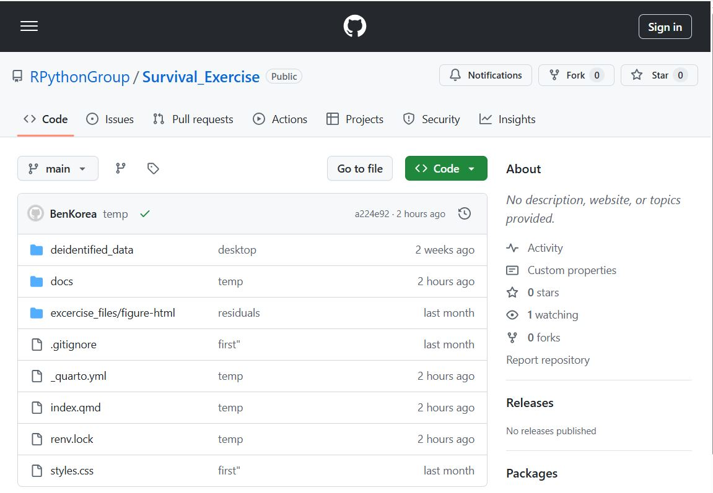
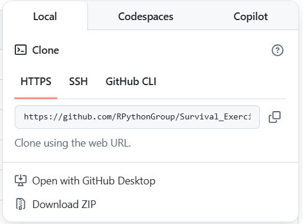

## RStudio(또는 server) 실행

::: {.callout-note title="RStudio(또는 server) 실행 설명" collapse="true" appearance="minimal"}
-   RStudo(또는 server)가 실행되었지만 만약 다른 프로젝트들이 자동으로 로딩되었다면 이들은 모두 닫아둡니다.
-   우하단의 Output pane의 Files tab에서 [연구회 웹사이트 RStudio 설정](https://rpythonstudy.github.io/website/posts/R/install/RStudio_setup.html){target="_blank"}에서 설정한 default working directory를 보여주면 정상입니다.
:::

## Git 설치확인

::: {.callout-note title="Git 설치확인 예시" collapse="true" appearance="minimal"}
-   RStudio(또는 server) Console pane의 Terminal tab에서 아래의 git 명령어를 실행하여 설치된 최신 version이 맞는지 확인합니다.

```{r git_install_verfication, eval=FALSE, filename="RStdio Terminal tab"}
git --version
```

-   오류가 있다면
    -   Tools \> Global Options... \> Git/SVM 메뉴에서 version control interface for RStudio가 check 되어있는지,
    -   git 실행파일의 경로가 제대로 인식되어 있는지
-   등을 확인하여 오류를 해결하고 진행 하시길 바랍니다.
:::

## 원격저장소 url 복사하기

::: {.callout-note title="원격저장소 url 복사하기 예시" collapse="true" appearance="minimal"}
-   Clone하고픈 원격저장소의 url을 이용하여 로컬(=자신의 PC 원하는 경로)로 다운로드 하는 개념입니다.
-   원격저장소 주소 예시 [https://github.com/RPythonGroup/Survival_Exercise](https://github.com/RPythonGroup/Survival_Exercise){target="_blank"}로 이동합니다.
-   아래의 그림과 같이 초록색 \<\>Code 버튼을 클릭하면 주소가 나타납니다.



-   팝업창 \> Local \> HTTPS를 선택하면 이래의 그림처럼 web URL이 나타나며 복사버튼을 이용할 수도 있습니다.


:::

## 원격저장소 프로젝트의 R버전 확인하기

::: {.callout-note title="원격저장소 프로젝트의 R버전 확인하기 예시" collapse="true" appearance="minimal"}
-   원격저장소의 프로젝트에는 R버전이 프로젝트명에 반영되어 있으면 직관적으로 알 수 있습니다.
    -   예시: `r443-survival_exercise`
-   우리 연구회처럼 renv로 패키지관리가 된 원격저장소 프로젝트라면 renv.lock 파일을 열어보면 첫머리에 R버전이 기록되어 있습니다.
-   만약 RStudio에서 실행 중인 R과 버전이 다르다면 RStudio(또는 server)에서 해당버전의 R실행파일로 설정을 변경하시면 됩니다. (필요시 해당버전의 R 추가 설치시 및 RStudio(또는 server)에서 R버전 변경은 연구회 웹사이트 해당부분을 참고하시길 바랍니다.)
:::

## Git clone하기

::: {.callout-note title="Git clone하기 예시" collapse="true" appearance="minimal"}
-   RStudio Console pane Terminal tab에서 아래의 git 명령어를 실행하여 원격저장소를 로컬로 복사합니다.

```{r git_clone, eval=FALSE, filename="RStdio Console pane Terminal tab"}
git clone <remote repository URL> <local directory>
```

-   <remote repository URL>은 복사해두었던 원격저장소url을 붙여넣기 하면 오타를 줄일 수 있습니다.
-   <local directory>은 r443-survival_exercise와 같이 r 실행파일의 버전과 프로젝트명으로 만들면 좋습니다.
:::

## RStudio 프로젝트로 만들기

-   물리적인 폴더는 만들어졌지만 RSytudio 프로젝트는 아니므로 만들어야 합니다.

::: {.callout-note title="RStudio 프로젝트로 만들기 예시" collapse="true" appearance="minimal"}
-   `RStudio>File` 메뉴에서 `New Project`를 선택
-   `Existing Directory`를 선택
-   Project working directory로 clone 시에 만들어졌던 디렉토리를 browsing하여 선택합니다.
-   [x] Open in new session: 다른 session을 열어두고자 한다면 체크를 해야함. RStudio server에서는 이 check가 없습니다. 이는 RStudio server에서는 session을 여러개 열 수 없기 때문입니다.
-   `Create Project` 버튼클릭
-   RStudio 프로젝트가 되었으면 우측 상단에 Project (None)이 설정한 프로젝트명으로 바뀌게 됩니다.
:::

## renv 설치 확인하기

::: {.callout-note title="renv 설치버전 확인하기 예시" collapse="true" appearance="minimal"}
-   연구회에서 만든 프로젝트는 renv로 독립적인 패키지관리를 하고 있습니다. 프로젝트 파일들을 clone 으로 local로 가져올 때, 패키지목록이 기록되어 있는 renv.lock 파일만 local로 가져오도록 설정되어 있습니다.
-   따라서 원격저장소를 만들었을 때와 같은 패키지버전들로 설치할려면 renv.lock 파일에 기록된 버전들로 설치하는 것이 필요합니다. (renv를 사용하지 않고 프로젝트를 실행할 때 R에서 해당 패키지가 없다고 인식하는 것을 설치하면 최신 패키지들이 설치되어 버전이 달라질 수도 있습니다.)
-   renv를 적용할려면 renv가 설치되어 있어야 하므로 확인하는 방법은 아래와 같이 버전을 확인하는 것도 한가지 방법입니다.

```{r renv_packageVersion, eval=FALSE, filename="RStdio Console pane Console tab"}
packageVersion("renv")
```

만약에 설치되어 있지 않다는 오류가 나온다면 아래의 명령으로 설치하시면 됩니다.

```{r renv_packageInstallation, eval=FALSE, filename="RStdio Console pane Console tab"}
install.packages("renv")
```
:::

## renv로 패키지 복원하기

::: {.callout-note title="renv로 패키지 복원하기 예시" collapse="true" appearance="minimal"}
-   패키지들을 renv.lock 파일에 기록된 버전으로 설치하는 명령어는 아래와 같습니다.

```{r renv_activate, eval=FALSE, filename="RStdio Console pane Console tab"}
renv::restore()
```

-   복원과정에서 renv가 아직 적용되지 않은 상태라서 activation 할지는 물어보는 메시지가 나오게 되는데 activate를 진행하시면 됩니다.
-   activate가 되면 프로젝트 폴더내에 renv 폴더가 생성되고 기본 패키지들이 설치됩니다.
-   아직은 renv.lock 파일에 기록된 패키지들이 설치된 것이 아니므로 위의 renv::restore() 명령어를 다시 실행하시면 됩니다.
:::

## 패키지 복원 확인하기

::: {.callout-note title="패키지 복원 확인하기 예시" collapse="true" appearance="minimal"}
-   복원이 완료되었느자 확인은 renv.lock 파일에 기록된 패키지들과 실제 설치된 패키지들이 현황을 비교하는 명령을 이용합니다.

```{r renv_status, eval=FALSE, filename="RStdio Console pane Console tab"}
renv::status()
```

-   실행결과 메세지가 `No issues found -- the project is in a consistent state.`이면 복원이 완료된 것입니다.
:::

## Hands-on 완료
